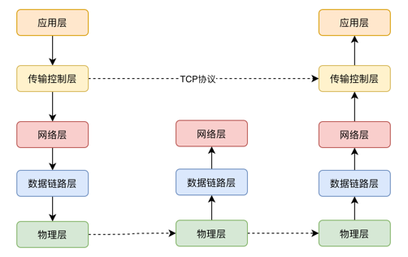
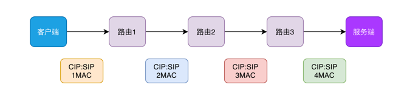

[[toc]]

## 网络基础

### OSGI 七层网络模型

物理层，数据链路层，网络层，传输层，(会话层)，(表示层)，应用层


(简化的五层协议) 物理层、数据链路层、网络层、传输控制层、应用层

### TCP 协议
TCP 是一种传输控制层的协议，是一种面向连接的，可靠的传输协议。

#### 三次握手

三次握手的行为保证了链接的可靠性，这里的可靠性值得是发送正确并且顺序正确。应用在Socket队列中的QueueBuffer的数据

1. 客户端->服务端: SYN 
2. 服务端->客户端: SYN+ACK
3. 客户端->服务端: ACK


::: details 详细步骤
1. 主机A发送位码为syn＝1,随机产生seq number=6的数据包到服务器，主机B由SYN=1知道，A要求建立联机；
2. 主机B收到请求后要确认联机信息，向A发送ack number=(主机A的seq+1),syn=1,ack=1,随机产生seq=7的包
3. 主机A收到后检查ack number是否正确，即第一次发送的seq number+1,以及位码ack是否为1，若正确，主机A会再发送ack number=(主机B的seq+1),ack=1，主机B收到后确认seq值与ack=1则连接建立成功。
4. DDOS工具就是在三次挥手的第二部后，客户端不给服务端响应，导致服务端一直等待，可以通过限制半连接的数量的方式以及缩短半连接的超时时间解决
::: 


#### 四次挥手

同样的关闭连接的时候使用的是四次挥手，断开连接就是**销毁资源**。

1. 客户端->服务端: FIN (客户端向服务端申请断开) 
2. 服务端->客户端: FIN +ACK (服务端同意断开) 
3. 服务端->客户端: FIN (服务端向客户端申请断开)
4. 客户端->服务端: ACK (客户端同意断开)


> 1. 客户端A发送一个FIN，用来关闭客户A到服务器B的数据传送。
> 2. 服务器B收到这个FIN，它发回一个ACK，确认序号为收到的序号加1。和SYN一样，一个FIN将占用一个序号。
> 3. 服务器B关闭与客户端A的连接，发送一个FIN给客户端A。
> 4. 客户端A发回ACK报文确认，并将确认序号设置为收到序号加1


实际的过程中，第 2 & 3 步可能会合成一个包，下面的抓包中展示了2，3 合包的现象。
使用 `curl doc.zhoutao123.com` & `tcpdump -nn -i [网卡名] [port xx] [host xx]` 命令可以进行四次挥手的验证以及Linux操作系统下的抓包


```text
# 三次握手的流程
IP 172.17.0.15.42952 > 81.69.98.83.80: Flags [S], seq 2642436197, win 64240, options [mss 1460,sackOK,TS val 3034559727 ecr 0,nop,wscale 7], length 0
IP 81.69.98.83.80 > 172.17.0.15.42952: Flags [S.], seq 1652405804, ack 2642436198, win 65160, options [mss 1424,sackOK,TS val 3034559728 ecr 3034559727,nop,wscale 7], length 0
IP 172.17.0.15.42952 > 81.69.98.83.80: Flags [.], ack 1, win 502, options [nop,nop,TS val 3034559729 ecr 3034559728], length 0

# 发送数据包，服务端返回ACK确认
IP 172.17.0.15.42952 > 81.69.98.83.80: Flags [P.], seq 1:83, ack 1, win 502, options [nop,nop,TS val 3034559729 ecr 3034559728], length 82: HTTP: GET / HTTP/1.1
IP 172.17.0.15.80 > 81.69.98.83.42952: Flags [.], ack 83, win 509, options [nop,nop,TS val 3034559730 ecr 3034559729], length 0

# 服务端返回数据，客户端返回ACK
IP 81.69.98.83.80 > 172.17.0.15.42952: Flags [P.], seq 1:406, ack 83, win 509, options [nop,nop,TS val 3034559730 ecr 3034559729], length 405: HTTP: HTTP/1.1 301 Moved Permanently
IP 172.17.0.15.42952 > 81.69.98.83.80: Flags [.], ack 406, win 501, options [nop,nop,TS val 3034559731 ecr 3034559730], length 0


# 客户端发起关闭FIN， 服务端向客户端返回ACK以及FIN (这里发生了2，3 合并)
IP 172.17.0.15.42952 > 81.69.98.83.80: Flags [F.], seq 83, ack 406, win 501, options [nop,nop,TS val 3034559731 ecr 3034559730], length 0
IP 81.69.98.83.80 > 172.17.0.15.42952: Flags [F.], seq 406, ack 84, win 509, options [nop,nop,TS val 3034559732 ecr 3034559731], length 0
IP 172.17.0.15.42952 > 81.69.98.83.80: Flags [.], ack 407, win 501, options [nop,nop,TS val 3034559733 ecr 3034559732], length 0


20 packets captured
24 packets received by filter
0 packets dropped by kernel
```


+ 常见的基于TCP协议的协议： FTP，SMTP，POP3，HTTP，
+ 常见的基于UDP协议的协议：DNS ,SNMP,TFTP

+ Socket 套接字

套接字是对应的关系，**Socket四元组 (IP:PORT--> IP:PORT) 保证了连接的唯一性**。 

套接字的查询可以使用 `nc [host] [port]` 可以创建TCP连接，然后通过命令   `netstat -natp | grep nc` 查询创建的连接 


+ 端口号

默认端口的范围最大值为 65535, 客户端可以与服务端指定端口建立65535个连接

> 1. 当应用层应用崩溃的时候，传输控制层并不清楚，因此应用层崩溃并不会造成连接的断开
> 2. TCP 连接并没有心跳机制，但是可以通过配置内核参数配置心跳
> 3. 根据Socket四元组唯一性，可以知道一台计算机设备中客户端可以和服务端的某个端口创建65535个连接，同时也可以和另外的一个端口创建65535个连接

  
### 网络层

+ IP地址

点分字节, 4个字节(32位)

+ 路由表

通过 `route -n` 即可显示Linux系统中配置的路由表, 通过将目标IP地址和子网掩码进行与运算得到的目标地址，然后交给相应的网关即可。
比如 向`www.zhoutao123.com`服务器发送数据的时候，通过DNS解析到其IP为 81.69.98.83 ,将 其与子网掩码 **Genmask** 按位与，得到主机号
将主机号与 **Destination** 比对，相同的话则扔到对应的**Gateway**中即可完成，即 **Gateway** 就是数据包的下一跳。

```shell
ubuntu@VM-0-15-ubuntu:~$ route -n
Kernel IP routing table
Destination     Gateway         Genmask         Flags Metric Ref    Use Iface
0.0.0.0         172.17.0.1      0.0.0.0         UG    100    0        0 eth0
172.17.0.0      0.0.0.0         255.255.240.0   U     0      0        0 eth0
```

+ 子网掩码
   子网掩码 & IP 地址 得到网络号剩下的为主机号
  

### 数据链路层

ARP 指令可以获取网关对应的Mac地址，而Mac地址则会被封装到数据链路层的包中进行传递.



如下面的则展示了ARP表

```shell
ubuntu@VM-0-15-ubuntu:~$ arp -n
Address                  HWtype  HWaddress           Flags Mask            Iface
172.17.0.1               ether   fe:ee:00:2e:16:9a   C                     eth0
```

当ARP表中不存在网关对应的Mac地址的时候，其会进行ARP广播，通过广播的方式获取网关的Mac地址,抓包数据如下

```shell
ubuntu@VM-0-15-ubuntu:~$ sudo tcpdump -nn -i eth0 arp
tcpdump: verbose output suppressed, use -v or -vv for full protocol decode
listening on eth0, link-type EN10MB (Ethernet), capture size 262144 bytes

# ARP 内容，谁有  172.17.0.1 的Mac地址，请告诉 172.17.0.15
22:30:17.625614 ARP, Request who-has 172.17.0.1 tell 172.17.0.15, length 28
# 有人回复说 172.17.0.1 在 fe:ee:00:2e:16:9a
22:30:17.625649 ARP, Reply 172.17.0.1 is-at fe:ee:00:2e:16:9a, length 28

2 packets captured
2 packets received by filter
0 packets dropped by kernel
```


## HTTPS
+ 对称加密算法

  
+ 非对称加密算法,无法解决S向客户端传输的安全性
```puml
entity 客户端 AS C
entity 服务端 AS S

C->S: 请求公钥
return 返回公钥
C->C: 解析验证公钥
C->S:使用公钥进行加密数据F(data) = Y
S->S: 服务端通过私钥进行解密
S->S: 执行业务逻辑
S x-[#00F]->x C: 不能使用PK加密后返回 
```

+ HTTPS的流程
```puml
entity 客户端 AS C
entity 服务端 AS S

C->S: 请求公钥 PK
return 返回公钥 PK
C->C: 解析验证公钥
C->S: 发送经过PK加密的随机数 Y 作为私钥 SK
S->S: 使用私钥进行解密，得到随机数 N 
S->C: 将数据使用随机数进行对称加密，返回客户端
C->C: 客户端使用私钥SK解密
```

+ 中间人攻击的过程

> 中间人攻击的问题需要CA认证证书，不在从S端获取PK，而是获取到经过CSK加密后的 License
> 客户端从CA拿到CPK解密 License 拿到 PK

```puml
entity 客户端 AS C
entity 中间人 AS H
entity 服务端 AS S

activate H

C->H: 请求公钥
return 返回公钥PK1
H->S: 请求公钥
return 返回公钥PK2

====
C->H: 使用PK1加密生成私钥SK1
return 解析出N1，返回OK

H->S: 使用PK2加密N1生成私钥SK2
return 解析出N1，返回OK

====

C->H: 使用SK1加密数据并发送
H->H: 使用私钥解析出数据

H->S: 使用SK2加密数据发送
return 服务端返回结果

H->H: 使用SK2解密出数据D
H->C: 返回使用SK1加密的数据D

deactivate H
```


## 其他

### HTTP协议
HTTP 1.0规定浏览器与服务器只保持短暂的连接，浏览器的每次请求都需要与服务器建立一个TCP连接，服务器完成请求处理后立即断开TCP连接，服务器不跟踪每个客户也不记录过去的请求。HTTP 1.1则支持持久连接Persistent Connection, 并且默认使用persistent connection. 在同一个tcp的连接中可以传送多个HTTP请求和响应. 多个请求和响应可以重叠，多个请求和响应可以同时进行. 更加多的请求头和响应头(比如HTTP1.0没有host的字段). 在1.0时的会话方式：建立连接、发出请求信息、回送响应信息、关掉连接

HTTPS就是使用SSL/TLS协议进行加密传输，让客户端拿到服务器的公钥，然后客户端随机生成一个对称加密的秘钥，使用公钥加密，传输给服务端，后续的所有信息都通过该对称秘钥进行加密解密，完成整个HTTPS的流程。


### 网站


+ 在浏览器中通过域名访问服务器的过程
  1.在浏览器中输入该域名
2. 浏览器通过DNS查找该域名的IP地址
   + 浏览器现在浏览器缓存中查找，（一般默认保存2-30分钟）
   + 如果在浏览器没找到记录，将在系统缓存中查找，windows系统会调用gethostbyname
   + 如果在系统缓存中没找到，会在路由缓存中查找，
   + ISP DNS 缓存 – 接下来要check的就是ISP缓存DNS的服务器。在这一般都能找到相应的缓存记录。
   + 递归搜索 – 你的ISP的DNS服务器从跟域名服务器开始进行递归搜索, 从.com顶级域名服务器到Facebook的	域名服务器
3. 浏览器给web服务器发送一个HTTP请求
4. 服务器响应消息到客服端
5. 浏览器获取到服务端的消息，进行解析，解析成html页面，

### 网络攻击手段

+ DDOS 攻击
+ XXS 攻击
+ CRSF 攻击