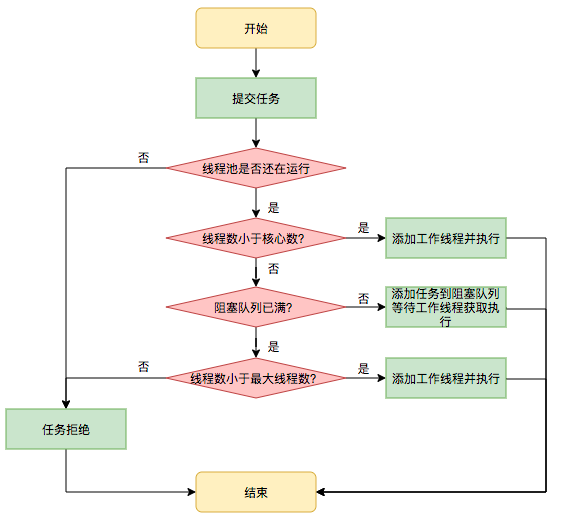
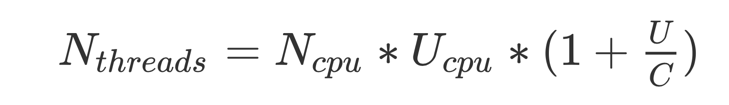

[[toc]]

## 死锁条件

1. 互斥条件：该资源任意一个时刻只由一个线程占用。
2. 请求与保持条件：一个进程因请求资源而阻塞时，对已获得的资源保持不放(一次性获取所有资源)
3. 不剥夺条件: 线程已获得的资源在未使用完之前不能被其他线程强行剥夺，只有自己使用完毕后才释放资源（申请其他资源时候，如获取不叨叨，则释放自己持有的资源）
4. 循环等待条件: 若干进程之间形成一种头尾相接的循环等待资源关系(按顺序申请资源)

```java
package com.zhoutao123.java.se.collect.thread;

import java.util.concurrent.TimeUnit;

/**
 * 线程死锁
 */
public class ThreadDeadLock {
    public static void main(String[] args) {
        String a = "a";
        String b = "b";
        new Thread(() -> {
            synchronized (a) {
                try {
                    System.out.println(Thread.currentThread().getName() + "获取到A锁");
                    TimeUnit.SECONDS.sleep(1);
                    synchronized (b) {
                        System.out.println(Thread.currentThread().getName() + "获取到B锁");
                    }
                } catch (InterruptedException e) {
                    e.printStackTrace();
                }
            }
        }, "线程A").start();

        new Thread(() -> {
            synchronized (b) {
                try {
                    System.out.println(Thread.currentThread().getName() + "获取到B锁");
                    TimeUnit.SECONDS.sleep(2);
                    synchronized (a) {
                        System.out.println(Thread.currentThread().getName() + "获取到A锁");
                    }
                } catch (InterruptedException e) {
                    e.printStackTrace();
                }
            }
        }, "线程B").start();
    }
}
```

### Java的线程状态
+ NEW: 线程创建完成，未调用start()方法之前的状态
+ RUNNABLE: 可运行的，等待CPU分配时间片
+ READY: 可以执行的线程状态
+ BLOCK: 阻塞, 调用 synchronized的时候进入阻塞状态
+ WAIT: Object.wait 以及 LockSupport.park 时候
+ WAIT_TIME: Object.wait(int timeout) 以及 LockSupport.park(timeout) 


## 线程分类

1. 系统级别线程 & 普通线程
    + Compile Thread: JIT编译线程
    + GC Thread : 垃圾回收的线程
    + PeriodicTaskThread: 周期性任务的线程，比如JVM采样
    + SignalDispatchThread: 处理OS通知信号的线程

2. 守护线程 & 非守护线程
    + 守护线程: 用来服务非守护线程的一类线程，当进程中不存在非守护线程的时候，守护线程也会关闭
    + 非守护线程:

## Java 多线程的问题

+ 避免无限制的创建线程，否则过多消耗CPU资源 & 降低线程稳定性
+ 如果处于RUNNABLE的线程数大于CPU的核心数，则有可能发生线程之间的调用，切换上下文
+ 当新的线程被创建的时候，其所需要的数据不再当前处理的本地缓存中，造成上下文的缓存缺失，因此线程首次调度的时候更加缓慢
+ 内存同步的开销，在使用synchronized 以及 volatile的时候造成本地缓存失效,同步会增加内存总线的通信量
+ 竞争产生同步，通常采用CAS或者OS挂起线程的方式，通过线程太多也会影响其他线程的性能，

## 多线程优化策略

+ 使用线程局部变量 ThreadLocal
+ 使用基于CAS的方案，如果竞争不存在或者竞争不激烈，CAS的效果一般高于传统监视器的方式，反之监视器的效果则更好
+ 减少锁竞争,锁竞争的两个影响因素： S = P(锁的请求频率) * T(持有锁的时间)
    1. 针对P的解决方式: 锁分解 (将临界资源分解，操作的时候只锁定一部分需要锁的资源)
    2. 针对T的结局方式: 分段锁 (HashMap 的Segment)
    3. 锁分段的劣势: 采取多段锁比单个锁的获取需要消耗更多的资源

+ 放弃使用独占锁, 尝试使用ReadWriteLock、原子变量 Atomic 系列
+ 尝试使用偏向锁,自旋锁
    1. 偏向锁的理论是 如果一个线程最近用到了某个锁，那么此线程下次执行由同一把锁保护的代码的数据可能仍然保存在处理器的缓存中。如果给这个线程优先获得锁的权利，那么缓存命中率就会增加。
    2. 使用自旋锁的时候尽可能的使同步代码块更短

## 线程池的流程



配置一个线程池是比较复杂的，尤其是对于线程池的原理不是很清楚的情况下，很有可能配置的线程池不是较优的，因此在Executors类里面提供了一些静态工厂，生成一些常用的线程池。

1. newSingleThreadExecutor
   > 创建一个单线程的线程池。这个线程池只有一个线程在工作，也就是相当于单线程串行执行所有任务。如果这个唯一的线程因为异常结束，那么会有一个新的线程来替代它。此线程池保证所有任务的执行顺序按照任务的提交顺序执行。

2. newFixedThreadPool
    > 创建固定大小的线程池。每次提交一个任务就创建一个线程，直到线程达到线程池的最大大小。线程池的大小一旦达到最大值就会保持不变，如果某个线程因为执行异常而结束，那么线程池会补充一个新线程。

3. newCachedThreadPool
    > 创建一个可缓存的线程池。如果线程池的大小超过了处理任务所需要的线程，
    那么就会回收部分空闲（60秒不执行任务）的线程，当任务数增加时，此线程池又可以智能的添加新线程来处理任务。此线程池不会对线程池大小做限制，线程池大小完全依赖于操作系统（或者说JVM）能够创建的最大线程大小。

4. newScheduledThreadPool
    > 创建一个大小无限的线程池。此线程池支持定时以及周期性执行任务的需求。


## 线程池的死锁

+ 线程池的任务需要无限期的的等待池中其他任务的接口，就会造成线程死锁，除非线程池线程数足够大。
+ 线程池线程过大则，将在CPU资源上发生竞争或者耗尽资源，过小则导致任务吞吐量降低，无法足够利用多核CPU。
+ 线程池大小计算公式, 或者使用动态线程池参数的方式:

<div style="width: 50%">
  
</div>

其他方案: coreSize = tps * time / maxSize = tps * time * (1.7 -2 )

--- 

+ 参考:
    1. [https://tech.meituan.com/2020/04/02/java-pooling-pratice-in-meituan.html](https://tech.meituan.com/2020/04/02/java-pooling-pratice-in-meituan.html)
    2. [https://blog.csdn.net/luofenghan/article/details/78596950](https://blog.csdn.net/luofenghan/article/details/78596950)

+ 思考:
    1. 动态线程池的实践
    <div style="width: 50%">
       
    </div>
