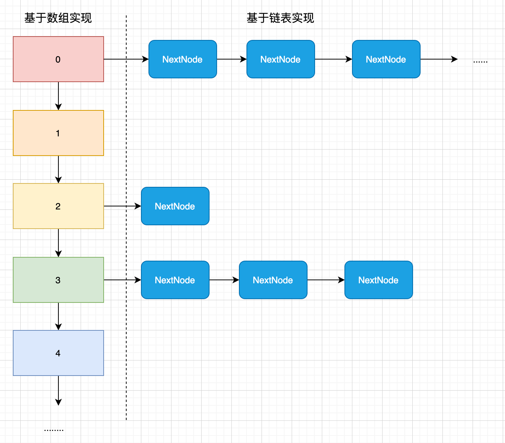
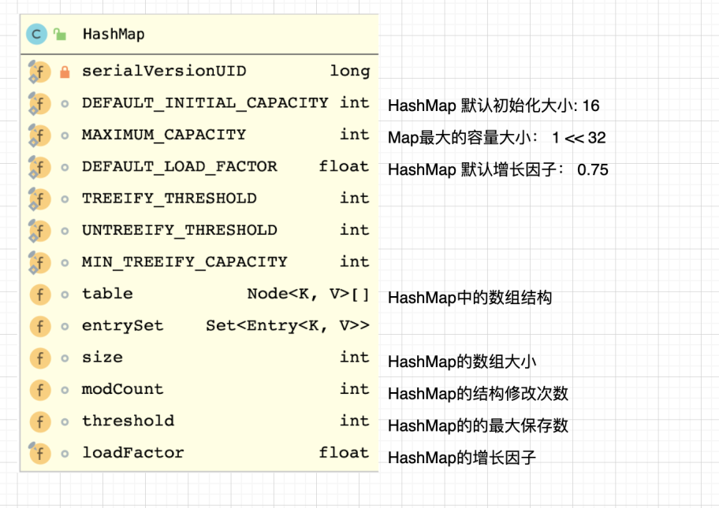

> 为了方便，这里暂未讲述JDK1.8的红黑树结构，请参考红黑树的操作算法相关的章节


HashMap是一个非常重要的数据结构，日常开发工作中，我们经常使用到HashMap,常见的操作就是:put & get . 其底层是数组和链表组成。


- [x] 添加元素的过程中，当两个对象出现Hash冲突之后，会将后者放置到链表中，依次类推，反之未出现hash冲突，则会创建一个新的数组元素放置于数组中。
- [x] 查询元素时候，首先查询key 的hash是够存在，存在的话，则遍历链表找到 与 `equal()` 方法返回True的对象


- 其大致结构如下图:
> 在JDK8 之后，链表如果长度超过8，就会将链表转化为红黑树，此图示并未展现此结构





<a name="5U0dG"></a>
## HashMap 创建


<a name="xo9lb"></a>
### 成员变量
HashMap内部的成员变量主要有：

- size: 集合的capacity
- table: 数组结构
- locafactor: 负载因子
- threshold： 最大的保存数 = size * loadfactor





table 就是我们说的HashMap中的数组实现，其类型为HashMap.Node<> 定义如下:


```java
    static class Node<K,V> implements Map.Entry<K,V> {
        final int hash; // 节点的hash
        final K key; 
        V value;
        Node<K,V> next; // 下一个节点，用于保存hash冲突的数据

        Node(int hash, K key, V value, Node<K,V> next) {
            this.hash = hash;
            this.key = key;
            this.value = value;
            this.next = next;
        }
    }
```


<a name="1253i"></a>
### 构造方法

- HashMap 总共有四种构造方法，日常工作中主要使用的也就两种:
- [x]  无参构造方法，默认增长因子 `DEFAULT_LOAD_FACTOR  = 0.75`
- [x]  携带初始化initialCapacity 的构造方法
```java
    public HashMap(int initialCapacity) {
        this(initialCapacity, DEFAULT_LOAD_FACTOR);
    }

    public HashMap() {
        this.loadFactor = DEFAULT_LOAD_FACTOR; // all other fields defaulted
    }

	// 此方法不建议使用，请不要随便修改 loadFactor 
    public HashMap(int initialCapacity, float loadFactor) {
        if (initialCapacity < 0)
            throw new IllegalArgumentException("Illegal initial capacity: " +
                                               initialCapacity);
        if (initialCapacity > MAXIMUM_CAPACITY)
            initialCapacity = MAXIMUM_CAPACITY;
        if (loadFactor <= 0 || Float.isNaN(loadFactor))
            throw new IllegalArgumentException("Illegal load factor: " +
                                               loadFactor);
        this.loadFactor = loadFactor;
        this.threshold = tableSizeFor(initialCapacity);
    }

    public HashMap(Map<? extends K, ? extends V> m) {
        this.loadFactor = DEFAULT_LOAD_FACTOR;
        putMapEntries(m, false);
    }
```


<a name="l3LrP"></a>
## HashMap 添加元素


<a name="na3Kb"></a>
### 添加元素
向 HashMap对象中添加元素主要是: `public V put(K key, V value)` ,这是一个非常复杂的操作，其流程如下:
```java
    public V put(K key, V value) {
        // 调用hash方法计算Key的哈希值
        return putVal(hash(key), key, value, false, true);
    }

    final V putVal(int hash, K key, V value, boolean onlyIfAbsent,
                   boolean evict) {
        Node<K,V>[] tab; Node<K,V> p; int n, i;
        // 如果集合table，也就是保存对象的数组为空数组，则进行resize() 操作
        // resize的详细说明在下一段落
        if ((tab = table) == null || (n = tab.length) == 0)
            n = (tab = resize()).length;
        // 如果添加的节点位置为null，说明还没有同样hash值的数据进入，那么直接设置到数组的指定位置即可
        if ((p = tab[i = (n - 1) & hash]) == null)
            tab[i] = newNode(hash, key, value, null);
        else {
            Node<K,V> e; K k;
			// 如果已经有元素了，那么判断量或者的hash是够相等，key 是否相等
            // 并且equal方法以及其他参数是够相等，完全相等，则说明是同一元素，直接覆盖即可
            if (p.hash == hash &&
                ((k = p.key) == key || (key != null && key.equals(k))))
                e = p;
            // 不相等说明出现了hash冲突那么我们直接将元素添加到红黑树或者链表中
            else if (p instanceof TreeNode)
                // 如果节点是一个红黑树，则添加到红黑树中
                e = ((TreeNode<K,V>)p).putTreeVal(this, tab, hash, key, value);
            else {
                // 如果不是红黑树的话，那么遍历链表
                for (int binCount = 0; ; ++binCount) {
                    // 如果发现节点为null的，构造新的节点，加入到链表的尾部即可
                    if ((e = p.next) == null) {
                        p.next = newNode(hash, key, value, null);
                        // 如果链表的长度大于或者等于 8-1 也就是7的话，开始转换为红黑树，这一点，我们后面再说
                        if (binCount >= TREEIFY_THRESHOLD - 1) // -1 for 1st
                            treeifyBin(tab, hash);
                        break;
                    }
                    // 如果发现同一元素，那么直接跳出
                    if (e.hash == hash &&
                        ((k = e.key) == key || (key != null && key.equals(k))))
                        break;
                    p = e;
                }
            }
            
            // 如果原来的元素之为null,并且允许修改value的话，则进行修改
            if (e != null) { // existing mapping for key
                V oldValue = e.value;
                if (!onlyIfAbsent || oldValue == null)
                    e.value = value;
                // 典型的模板方法,留给子类实现
                afterNodeAccess(e);
                return oldValue;
            }
        }
        ++modCount;
        // 如果添加后的值小于最大保存数，则再次调整大小
        if (++size > threshold)
            resize();
        // 典型的模板方法,留给子类实现
        afterNodeInsertion(evict);
        return null;
    }

```


<a name="dnsen"></a>
### 调整数组大小
HashMap经常会出现调整大小的问题，因此建议在构造HashMap的时候预估一个初始化大小，一般等于 `基本大小/负载因子 + 1`  这样可以防止出现过多的调整，提升HashMap的性能。
```java
final Node<K,V>[] resize() {
        Node<K,V>[] oldTab = table;
        int oldCap = (oldTab == null) ? 0 : oldTab.length;
        int oldThr = threshold;
        int newCap, newThr = 0;
    
    	// 如果原容量大于最大值，则 `threshold = Integer.MAX_VALUE;` 
        if (oldCap > 0) {
            if (oldCap >= MAXIMUM_CAPACITY) {
                threshold = Integer.MAX_VALUE;
                return oldTab;
            }
            // 否则的话，容量扩增一倍， 即new = old * 2;
            else if ((newCap = oldCap << 1) < MAXIMUM_CAPACITY &&
                     oldCap >= DEFAULT_INITIAL_CAPACITY)
                newThr = oldThr << 1; // double threshold
        }
    	// 如果 oldCap ==0 & oldThr > 0 属于第一次扩容，name将原的赋值给newCap
        else if (oldThr > 0) // initial capacity was placed in threshold
            newCap = oldThr;
        else {               // zero initial threshold signifies using defaults
            // 如果都是0 使用默认值扩容
            newCap = DEFAULT_INITIAL_CAPACITY;
            newThr = (int)(DEFAULT_LOAD_FACTOR * DEFAULT_INITIAL_CAPACITY);
        }
        if (newThr == 0) {
            float ft = (float)newCap * loadFactor;
            newThr = (newCap < MAXIMUM_CAPACITY && ft < (float)MAXIMUM_CAPACITY ?
                      (int)ft : Integer.MAX_VALUE);
        }
        threshold = newThr;
        @SuppressWarnings({"rawtypes","unchecked"})
        Node<K,V>[] newTab = (Node<K,V>[])new Node[newCap];
        table = newTab;
        if (oldTab != null) {
            // 遍历原数组，开始调整数据
            for (int j = 0; j < oldCap; ++j) {
                Node<K,V> e;
                if ((e = oldTab[j]) != null) {
                    // 如果集合元素不等于null,将此元素移除，重新根据  e.hash & (newCap - 1)计算位置
                    oldTab[j] = null;
                    if (e.next == null)
                        newTab[e.hash & (newCap - 1)] = e;
                    // 如果是红黑树，则调整红黑树
                    else if (e instanceof TreeNode)
                        ((TreeNode<K,V>)e).split(this, newTab, j, oldCap);
                    else { // preserve order
                        // 如果是链表，则遍历链表调整位置
                        Node<K,V> loHead = null, loTail = null;
                        Node<K,V> hiHead = null, hiTail = null;
                        Node<K,V> next;
                        do {
                            next = e.next;
                            if ((e.hash & oldCap) == 0) {
                                if (loTail == null)
                                    loHead = e;
                                else
                                    loTail.next = e;
                                loTail = e;
                            }
                            else {
                                if (hiTail == null)
                                    hiHead = e;
                                else
                                    hiTail.next = e;
                                hiTail = e;
                            }
                        } while ((e = next) != null);
                        if (loTail != null) {
                            loTail.next = null;
                            newTab[j] = loHead;
                        }
                        if (hiTail != null) {
                            hiTail.next = null;
                            newTab[j + oldCap] = hiHead;
                        }
                    }
                }
            }
        }
        return newTab;
    }
```


> 总体看来，对于HashMap添加元素，其复杂性相对于List等实现还要高上一层。


<a name="VzcmT"></a>
## HashMap 获取元素
获取HashMap的预算使用方法  `public V get(Object key)`  来实现，这里看一下源码
```java
    public V get(Object key) {
        Node<K,V> e;
        return (e = getNode(hash(key), key)) == null ? null : e.value;
    }

    final Node<K,V> getNode(int hash, Object key) {
        Node<K,V>[] tab; Node<K,V> first, e; int n; K k;
        // 判断数组以及按照hash定义的值是否是空的，空的话直接返回null，否则才进行查找
        if ((tab = table) != null && (n = tab.length) > 0 &&
            (first = tab[(n - 1) & hash]) != null) {
            // 检查第一个对象是否等于key,等于的话返回
            if (first.hash == hash && // always check first node
                ((k = first.key) == key || (key != null && key.equals(k))))
                return first;
            if ((e = first.next) != null) {
                // 如果是红黑树，则从红黑树中查询，否则遍历链表查询
                if (first instanceof TreeNode)
                    return ((TreeNode<K,V>)first).getTreeNode(hash, key);
                // 遍历链表查询
                do {
                    if (e.hash == hash &&
                        ((k = e.key) == key || (key != null && key.equals(k))))
                        return e;
                } while ((e = e.next) != null);
            }
        }
        return null;
    }
```


<a name="ZiHY5"></a>
## HashMap 移除元素


```java
    public V remove(Object key) {
        Node<K,V> e;
        // 计算hash
        return (e = removeNode(hash(key), key, null, false, true)) == null ?
            null : e.value;
    }

    final Node<K,V> removeNode(int hash, Object key, Object value,
                               boolean matchValue, boolean movable) {
        Node<K,V>[] tab; Node<K,V> p; int n, index;
        // 如果table存在并且其hash存在相关的元素，则开始查找，否则直接返回找不到
        if ((tab = table) != null && (n = tab.length) > 0 &&
            (p = tab[index = (n - 1) & hash]) != null) {
            // node就是要被移除的节点
            Node<K,V> node = null, e; K k; V v;
            // 如果等于该元素等于目标元素，则直接返回 node = p;
            if (p.hash == hash &&
                ((k = p.key) == key || (key != null && key.equals(k))))
                node = p;
            else if ((e = p.next) != null) {
                // 如果是红黑树或者链表，则继续按照红黑树或者链表查询出需要删除的node
                if (p instanceof TreeNode)
                    node = ((TreeNode<K,V>)p).getTreeNode(hash, key);
                else {
                    do {
                        if (e.hash == hash &&
                            ((k = e.key) == key ||
                             (key != null && key.equals(k)))) {
                            node = e;
                            break;
                        }
                        p = e;
                    } while ((e = e.next) != null);
                }
            }
            // 如果node存在，并且值匹配，则删除
            if (node != null && (!matchValue || (v = node.value) == value ||
                                 (value != null && value.equals(v)))) {
                if (node instanceof TreeNode)
                    ((TreeNode<K,V>)node).removeTreeNode(this, tab, movable);
                else if (node == p)
                    tab[index] = node.next;
                else
                    p.next = node.next;
                ++modCount;
                --size;
                afterNodeRemoval(node);
                return node;
            }
        }
        return null;
    }
```


<a name="Ev3ia"></a>
## 总结


- [x] 其实HashMap也并非必须扩容，但是不扩容的话，会造成链表过长，查找效率降低
- [x] 为了方式HashMap出现多次扩容，导致性能问题，建议设置初始化大小 = 初始化大小 / 负载因子 + 1
- [x] HashMap中根据hash值定位的方式是 `(n-1) & hash` 的方式，最大值也就是 (n-1) 因此不会出现数组越界的问题


<a name="4kgV1"></a>
## 参考文章

- [掘金-HashMap底层实现原理](https://juejin.im/post/5c1c79b16fb9a049a711c97c)
