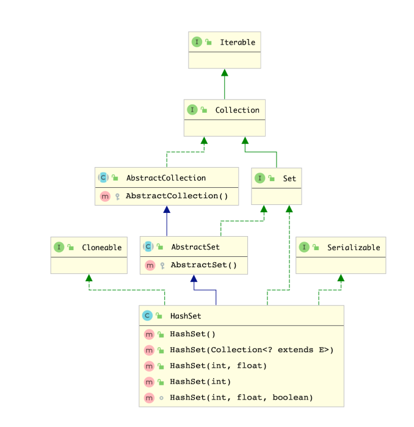

HashSet 是Jdk提供一种对象容器，元素不可重复的数据结构，经常被用于去重或者着重声明集合为不重复的集合的作用，其类图如下所示。




和 `ArrayList` 相比，HashSet多了两个构造方法 `HashSet(int,float)` & `HashSet(int,float,boolean)` 这里来着重分析下这五个构造方法，查看其是如何实现构造的。


<a name="IwWIA"></a>
## HashSet 的构造方法
```java
    public HashSet() {
        map = new HashMap<>();
    }

    public HashSet(Collection<? extends E> c) {
        map = new HashMap<>(Math.max((int) (c.size()/.75f) + 1, 16));
        addAll(c);
    }

    public HashSet(int initialCapacity, float loadFactor) {
        map = new HashMap<>(initialCapacity, loadFactor);
    }

    public HashSet(int initialCapacity) {
        map = new HashMap<>(initialCapacity);
    }

	/**
     * Constructs a new, empty linked hash set.  (This package private
     * constructor is only used by LinkedHashSet.) The backing
     * HashMap instance is a LinkedHashMap with the specified initial
     * capacity and the specified load factor.
     *
     * @param      initialCapacity   the initial capacity of the hash map
     * @param      loadFactor        the load factor of the hash map
     * @param      dummy             ignored (distinguishes this
     *             constructor from other int, float constructor.)
     * @throws     IllegalArgumentException if the initial capacity is less
     *             than zero, or if the load factor is nonpositive
     */
    HashSet(int initialCapacity, float loadFactor, boolean dummy) {
        map = new LinkedHashMap<>(initialCapacity, loadFactor);
    }
```
可以看到，HashSet的底层仍然使用的是HashMap作为基础实现，对HashMap的分析可以查看笔者的通栏目的文章 [HashMap 底层源码分析](https://www.zhoutao123.com/page/book/java/category/qgh3pq)，但特殊的是 `HashSet(int initialCapacity, float loadFactor, boolean dummy)` 则使用的是 `LinkedHashMap` 作为实现,此方法是并非公有方法，是给 `LinkedHashSet` 使用的，这里暂时忽略之。


<a name="1195C"></a>
## HashSet 添加元素
HashSet 中是如何添加不可重复的元素的，我们这里可以看下


```java
    private static final Object PRESENT = new Object();

	public boolean add(E e) {
        return map.put(e, PRESENT)==null;
    }
```


可以看到，这里实现的方式是向Map中新增元素，将对象作为KEY，将一个静态方法作为VALUE， `Map` 中的Key如果重复会自动的覆盖，所以这里使用的是Map的KEY集合作为唯一，这也是比较巧妙的。


<a name="JiJ3a"></a>
## HashSet 移除元素
```java
    private static final Object PRESENT = new Object();  

	public boolean remove(Object o) {
        return map.remove(o)==PRESENT;
    }
```


从HashSet添加元素的方式，就可以大致知道HashSet的元素是如何实现的，显然是直接移除指定KEY，然后判断移除的key对应的value是否等于 PRESENT，也就是当时保存的对象


<a name="PRLbr"></a>
## HashSet的其他方法实现


其实HashSet的底层实现大部分都是调用Map的相关实现方法，这里可以参考笔者的同栏文章 [HashMap 底层源码分析](https://www.zhoutao123.com/page/book/java/category/qgh3pq)


<a name="O8Dj6"></a>
## 集合大小
```java
    public int size() {
        return map.size();
    }
```


<a name="V4Vlo"></a>
### 是否空集
```java
    public boolean isEmpty() {
        return map.isEmpty();
    }
```


<a name="MVl8t"></a>
### 清空集合


```java
    public void clear() {
        map.clear();
    }
```


