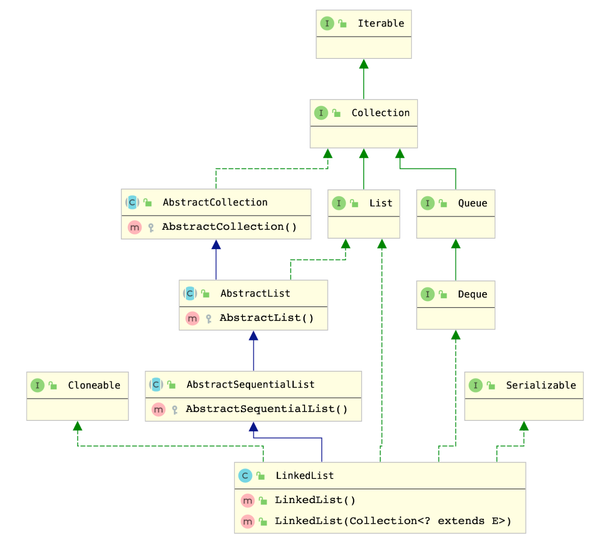
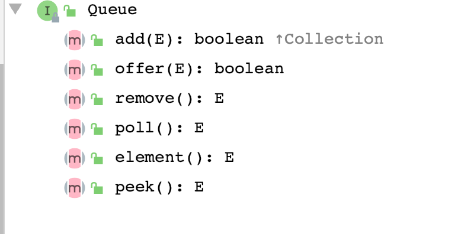
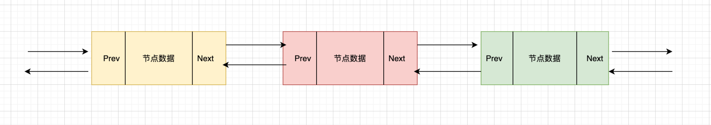

LinkedList在JDK中也占据比较重要的角色，其底层由双向链表实现，其实笔者分析LinkedList源码一路下来并没有发现复杂的地方，更多的是对双向链表的理解和其操作方法，比如链表的添加和移除等等，读者如果在这里感觉理解的很吃力，可以先去熟悉下双向链接然后早理解LinkedList可能效果更好。LinkedList的一些其他操作，笔者这里并没有过多的分析，其源码的操作方式和双向链接无异，有兴趣的读者可以自行查阅。


LinkedList 的类图关系如下：


> 

> 由此可见LinkedList 除了是一个集合之外，也是一个双端队列，因为其实现了Deque 接口，其中Queue的方法如下：

> 

每个节点的类型为`Node<E>`,Node 类型是LinkedList的一个私有的静态内部类实现，定义如下:


```java
    private static class Node<E> {
		// 节点数据
        E item;
        // 下一节点
        Node<E> next;
        // 上一节点
        Node<E> prev;

        // 节点的构造方式
        Node(Node<E> prev, E element, Node<E> next) {
            this.item = element;
            this.next = next;
            this.prev = prev;
        }
    }
```


所以在LinkedList中的链表实现如下图：



<a name="cLsOe"></a>
### 
<a name="1ddBa"></a>
## LinkedList的构造方法


LinkedList 有两种构造方法,无参构造和一个接收集合的构造方法，无参构造方法什么也不做，我们想来看有参的构造方法


- [x] public LinkedList()
- [x] public LinkedList(Collection<? extends E> c)


首先调用无参构造方法，创建一个空的集合数组，之后调用addAll(Collect) 方法向其中添加数据。
在方法 `addAll(int index, Collection<? extends E> c)` 中 `index` 标识添加数据的索引位置，这里传递了 `size` 也就是集合的size，name就表示从链表的尾部接入集合。


```java
    public LinkedList(Collection<? extends E> c) {
        this();
        addAll(c);
    }

    public boolean addAll(Collection<? extends E> c) {
        return addAll(size, c);
    }

    public boolean addAll(int index, Collection<? extends E> c) {
        checkPositionIndex(index);

        Object[] a = c.toArray();
        int numNew = a.length;
        if (numNew == 0)
            return false;

        Node<E> pred, succ;
        // 如果index == size 说明是从链表的尾部插入,那么
        // 前置节点pred就是最后一个节点，所以 pred = last;
        // 后置节点 succ = null
        if (index == size) {
            succ = null;
            pred = last;
        } else {
            // 如果不是从尾部插入，那么找出插入的节点位置，将此节点作为后置节点，后置节点的pred就是前置节点
            succ = node(index);
            pred = succ.prev;
        }

        // 遍历插入的集合
        for (Object o : a) {
            @SuppressWarnings("unchecked") E e = (E) o;
            // 构造新的节点
            Node<E> newNode = new Node<>(pred, e, null);
            // 如果前置节点为null，说明没有前置节点，需要设置新的节点为首节点
            // 否则设置新的节点为前置节点的next
            if (pred == null)
                first = newNode;
            else
                pred.next = newNode;
            pred = newNode;
        }

        // 如果后置节点为null，说明是从尾部添加的,那么 把后置节点设置为pred
        if (succ == null) {
            last = pred;
        } else {
            pred.next = succ;
            succ.prev = pred;
        }

        size += numNew;
        modCount++;
        return true;
    }
```


<a name="YesXL"></a>
## LinkedList 添加元素
向LinkedList类型的集合中添加元素主要有两种方式 `public boolean add(E e)`  以及 `public void add(int index, E element)` ，这两种方式分别表示添加元素到链表的尾位以及添加到指定位置。


<a name="Fz2cE"></a>
### 添加元素到尾部
```java
    public boolean add(E e) {
        linkLast(e);
        return true;
    }
    void linkLast(E e) {
        final Node<E> l = last;
        final Node<E> newNode = new Node<>(l, e, null);
        last = newNode;
        // 如果尾部节点为null，说明链表是空的，将新的节点设置为null即可
        if (l == null)
            first = newNode;
        else
            l.next = newNode;
        size++;
        modCount++;
    }
```


<a name="cAWXl"></a>
### 添加元素到指定位置


```java
    public void add(int index, E element) {
        checkPositionIndex(index);
		
        // 如果是添加到尾部，name直接调用linkLast方法，上面已经分析过
        if (index == size)
            linkLast(element);
        else
            // 否则调用追加到尾部的方法，node(index) 找到指定节点，添加到其之前
            linkBefore(element, node(index));
    }

    void linkBefore(E e, Node<E> succ) {
        // assert succ != null;
        final Node<E> pred = succ.prev;
        final Node<E> newNode = new Node<>(pred, e, succ);
        succ.prev = newNode;
        if (pred == null)
            first = newNode;
        else
            pred.next = newNode;
        size++;
        modCount++;
    }
```


<a name="CYKzL"></a>
## LinkedList 移除元素


<a name="ff8tp"></a>
### 按元素移除
```java
    public boolean remove(Object o) {
        if (o == null) {
            for (Node<E> x = first; x != null; x = x.next) {
                if (x.item == null) {
                    unlink(x);
                    return true;
                }
            }
        } else {
            for (Node<E> x = first; x != null; x = x.next) {
                if (o.equals(x.item)) {
                    unlink(x);
                    return true;
                }
            }
        }
        return false;
    }
```


<a name="fdHE0"></a>
### 按索引移除
```java
    public E remove(int index) {
        checkElementIndex(index);
        return unlink(node(index));
    }

    E unlink(Node<E> x) {
        // assert x != null;
        final E element = x.item;
        final Node<E> next = x.next;
        final Node<E> prev = x.prev;

        if (prev == null) {
            first = next;
        } else {
            prev.next = next;
            x.prev = null;
        }

        if (next == null) {
            last = prev;
        } else {
            next.prev = prev;
            x.next = null;
        }

        x.item = null;
        size--;
        modCount++;
        return element;
    }
```
