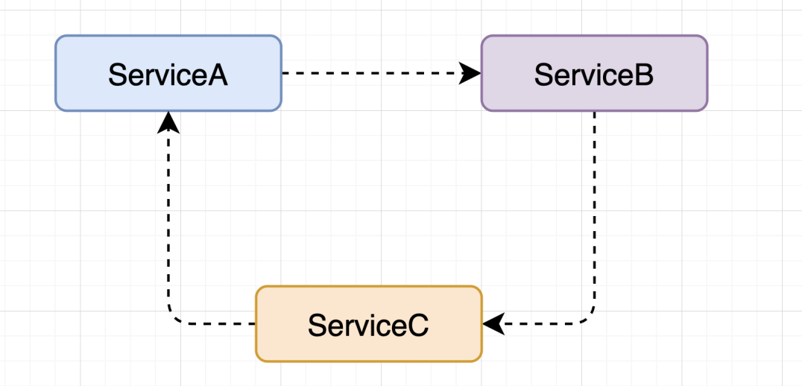

[[toc]]


 在日常的开发中，会不可避免的遇到Bean之间循环依赖的。所谓的循环依赖，就是两个或者两个以上的Bean互相持有对方，这样在程序运行调用中，会出现这种循环依赖的现象，假设是两个Service，当程序调用ServiceA时，ServiceA中依赖ServiceB，在ServiceB中又依赖了ServiceA，这样就形成了循环依赖，如下图：



> 如果系统中出现循环依赖，一方面也说明了你的项目架构出现了问题，应当首先从系统的角度出发，而不是从Spring的循环依赖解决出发!!!


Spring 提供了字段注入和构造器注入的方式来注入依赖。


## 字段注入(注入单例)


首先定义ServiceA和ServiceB，然后在配置类中注入ServiceA和ServiceB, 并尝试调用ServiceA的print方法


```java
public class ServiceA {

  @Autowired
  private ServiceB serviceB;

  public void print() {
    System.out.println(this);
    serviceB.print();
  }
}

public class ServiceB {

  @Autowired
  private ServiceA serviceA;

  public void print() {
    System.out.println(this);
  }
}

```


注入IOC容器中添加Serice，然后在main方法中获取ServiceA的实例，查看注入的数据
```java
@Configuration
public class MainConfigOfBeanRecycle {

  @Bean
  public ServiceA serviceA(){
    return new ServiceA();
  }


  @Bean
  public ServiceB serviceB(){
    return new ServiceB();
  }


  public static void main(String[] args) {
    AnnotationConfigApplicationContext context = new AnnotationConfigApplicationContext(MainConfigOfBeanRecycle.class);
    ServiceA bean = context.getBean(ServiceA.class);
    bean.print();
  }
}
```
可以观察到输出结果，并没有出现循环依赖的问题:
```
com.zhoutao123.spring.bean.ServiceA@1dd92fe2
com.zhoutao123.spring.bean.ServiceB@6b53e23f
```
## 多例注入(Prototype)
修改上面的ServiceA & ServiceB 添加`@Scope("prototype")` 注解，标识非单例模式，尝试启动，发现报错,抛出异常 `BeanCurrentlyInCreationException` 


```
Requested bean is currently in creation: Is there an unresolvable circular reference?
```


## 构造器注入
将ServiceA和ServiceB 修改为构造注入的方式，再次尝试启动IOC容器，观察结果


```java
@Component
public class ServiceA {
    
  private ServiceB serviceB;

  // 构造方式注入ServiceB
  public ServiceA(ServiceB serviceB) {
    this.serviceB = serviceB;
  }
}

@Component
public class ServiceB {
  
  private  ServiceA serviceA;

  public ServiceB(ServiceA serviceA) {
    this.serviceA = serviceA;
  }
}


```
启动IOC容器，发现仍然报循环应用的错误，异常为 `BeanCurrentlyInCreationException` 


```
Requested bean is currently in creation: Is there an unresolvable circular reference?
```


- 在SpringBoot中尝试实现则发现出现了更详细的循环依赖图
```
Description:

The dependencies of some of the beans in the application context form a cycle:

┌─────┐
|  serviceA defined in file [/Users/zhoutao/workspace/MyGithub/SpringBoot/build/classes/java/main/com/zhoutao123/spring/springboot/service/ServiceA.class]
↑     ↓
|  serviceB defined in file [/Users/zhoutao/workspace/MyGithub/SpringBoot/build/classes/java/main/com/zhoutao123/spring/springboot/service/ServiceB.class]
└─────┘

```


## 现象说明


在上面的三个实例中，构造注入和Prototype的两种方式出现循环依赖的问题，字段注入的方式没有出现循环依赖的情况，这说明Spring是可以解决单例模式下的字段注入的循环依赖的、

## 三级缓存


Spring内部常见Bean的时候会创建缓存，共计有三个缓存，我们称之为三级缓存的方式，其定义如下:


```java
	/** 单实例Bean ,Key 是Bean的名称，Value是Bean的实例*/
	private final Map<String, Object> singletonObjects = new ConcurrentHashMap<>(256);

	/** 缓存Bean的Factory 	,Key 是Bean的名称，Value是Bean的工厂实例 */
	private final Map<String, ObjectFactory<?>> singletonFactories = new HashMap<>(16);

	/** 缓存早期的Bean，早期的Bean指的是不完美的Bean，属性设置未完成的Bean */
	private final Map<String, Object> earlySingletonObjects = new HashMap<>(16);
```


其解决循环依赖的流程如下


1. 在 finishBeanFactoryInitialization 方法中开始通过反射的方式创建 ServiceA，并标记A正在创建中，保存在二级缓存 earlySingletonObjects`
1. 之后开始设置ServiceA的属性，发现ServiceA依赖于ServiceB，开始从缓存singletonObjects中获取ServiceB，发现ServiceB没有被创建，并未在一级缓存和二级缓存中发现ServiceB，所以从singletonFactories中创建SerIversonB，创建完成后，将ServiceB保存到二级缓存earlySingletonObjects中
1. 开始尝试为ServiceB设置属性，发现依赖ServiceA，尝试从一级缓存singletonObjects缓存中查找ServiceA，未发现，再次从二级缓存 earlySingletonObjects中获取，发现ServiceA的引用，设置到ServiceB的属性上，ServiceB创建完成之后，转换移一级缓存singletonObjects中，返回ServiceB的引用
1. ServiceB创建完成并返回引用后后，ServiceB单例被保存在一级缓存singletonObjects缓存中，最后为ServiceA设置字段属性就可以找到ServiceB的引用，设置属性并转移到一级缓存中
