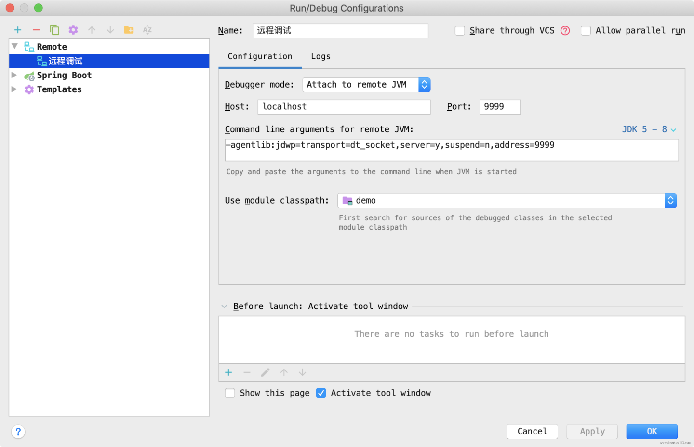
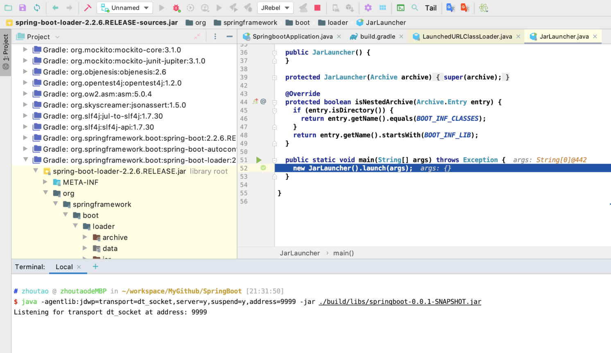

# JAR文件格式以及JDWP调试


## JAR文件是如何启动的？
SpringBoot构建的结果中，尝尝会以JAR文件的形式提供，众所周知，JAR文件本质上是一个特殊的压缩文件，这里我们创建一个简单的SpringBoot项目，使用Maven 或者Gradle 构建，然后解压，其内容格式如下:


```
├── BOOT-INF
│   ├── classes
│   │   ├── application.properties
│   │   ├── com
│   │   ├── static
│   │   └── templates
│   └── lib
│       ├── classmate-1.5.1.jar
|       |—— 这里由于篇幅忽略一写第三方的依赖JAR
│       └── tomcat-embed-websocket-9.0.33.jar
├── META-INF
│   └── MANIFEST.MF
└── org
    └── springframework
        └── boot

```
可以很明显的看到，JAR中包含了第三方的JAR包，这显然使用默认的应用类加载器是无法加载编译生成的class的以及我们生成的目录classes中的的class文件的。


尝试查看 MAINFEST.MF 文件，其内容如下:
```shell
$ cat ./build/libs/springboot-0.0.1-SNAPSHOT/META-INF/MANIFEST.MF 
Manifest-Version: 1.0
Start-Class: com.zhoutao123.spring.springboot.SpringbootApplication
Spring-Boot-Classes: BOOT-INF/classes/
Spring-Boot-Lib: BOOT-INF/lib/
Spring-Boot-Version: 2.2.6.RELEASE
Main-Class: org.springframework.boot.loader.JarLauncher

```

- MAINFEST.MF 文件的格式内容，可以参考: [JAR 文件格式规范](https://docs.oracle.com/javase/6/docs/technotes/guides/jar/jar.html#Signed%20JAR%20File)


Main-Class 指定了JVM 在运行JAR文件的是时候，所启动的类，这个类必须包含一个共有的静态的main方法，**这也是为什么SpringBoot的在打包的时候，会将org.springframework.boot.loader 的包给放到最外层，这样,其启动类 ****`Launcher.class`**** 就可以正常的被加载到系统类加载器**, **在其他位置的加载器中，系统类加载器无法加载的JAR文件或者BOOT-INFO/classes 文件下的 class文件，则使用自定义的类加载器加载。**可以通过下面的代码验证，SpringBoot APP的启动类并不是系统类加载器加载，而是自定义的类加载器加载的。


```java
@SpringBootApplication
public class SpringbootApplication {

  public static void main(String[] args) {
    System.out.println("当前类的加载器为:" + SpringbootApplication.class.getClassLoader());
    SpringApplication.run(SpringbootApplication.class, args);
  }
}
```


**请不要尝试在IDE中尝试验证**，如果在IDE中运行的话，你可能得到的结果如下，这里因为在集成开发环境中运行，class文件是松散的保存在classPath目录中的，这时候并没有启动自定义的加载类，因为仍然是默认的系统类加载器加载。
```
当前类的加载器为:sun.misc.Launcher$AppClassLoader@18b4aac2
```


构建成新的JAR文件之后，使用 `java -jar xxxx.jar` 命令启动后，可以看到输出为


```
当前类的加载器为:org.springframework.boot.loader.LaunchedURLClassLoader@5197848c
```


- [x]  可以看到，系统类加载器为 `org.springframework.boot.loader.LaunchedURLClassLoader` 这就是我们将要深入学习的SpringBoot的自定义类加载器。


## 使用JDWP来远程调试
上面的JAR文件的类加载器是JVM启动的才会调用，在IDE中调试并不是使用SpringBoot的自定义类加载器加载，因此我们这里需要使用JDK的远程调试功能来调试代码。
在命令行输入如下格式的语法命令，来启动JAR，这里不再对JDWP过多的赘述，有兴趣的可以在网上查一下。
```bash
java -agentlib:jdwp=transport=dt_socket, \
              server=y,suspend=y,address=9999 \
              -jar xxxx.jar
```
然后，在IDEA中，创建远程调试，信息如下:





然后在Gradle依赖中添加 SpringBootLoader的依赖
```groovy
implementation 'org.springframework.boot:spring-boot-loader'
```


  或者Maven的pom文件中添加 
```xml
<dependency>
    <groupId>org.springframework.boot</groupId>
    <artifactId>spring-boot-loader</artifactId>
</dependency>

```


找到  JarLauncher 类添加断点，然后以Degbug模式启动在IDEA创建的远程调试，即可看到正确进入断点。



