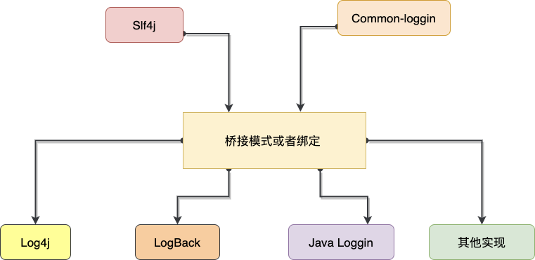

# SpringBoot的日志配置


Java提供了丰富的日志框架，尝尝让我们眼花缭乱，下面整理了他们之间的关系图：





SpringBoot 下提供了多种日志框架，接口层次主要是slf4j & apache common-logging 具体的实现主要有log4j & logback等，在SpringBoot页面，我们可以在resource目录下创建   `logback-spring.xml` 配置文件来标注日志的行为。


```xml
<?xml version="1.0" encoding="UTF-8" ?>
<configuration>
  <!--  导入基本的默认配置-->
  <include resource="org/springframework/boot/logging/logback/base.xml"/>

  <!--  通用等级，按照包名配置，输出的等级为ERROR-->
  <logger name="com.zhoutao123.spring.springboot" level="ERROR"/>


  <!--  根据环境来定义,优先级比上面的配置方式等级高-->
  
  
  <!-- 默认的actioveProfile-->
  <springProfile name="default">
    <logger name="com.zhoutao123.spring.springboot" level="DEBUG"/>
  </springProfile>

  

  <!--dev环境的配置-->
  <springProfile name="dev">
    <!--配置日志的环境变量-->
    <property name="APP_NAME" value="TEST"/>
    <property name="PATH" value="/tmp/log"/>
    <property name="FILE_LOG" value="${PATH}/${APP_NAME}/log.log"/>


    <!--  Appender 配置-->
    <appender class="ch.qos.logback.core.rolling.RollingFileAppender" name="APP">
      <!--配置日志目录-->
      <file>${FILE_LOG}</file>

			<!--配置日志文件的编码以及格式-->
      <encoder>
        <charset>utf8</charset>
        <pattern><![CDATA[
          %d{yyyy年MM月dd日 HH:mm:ss.SSS} 线程:[%thread] %X{TRACE_ID} %X{USER_ID} %-5level %logger.%M - %msg%n
        ]]></pattern>
      </encoder>

      <!--   规则策略-->
      <rollingPolicy class="ch.qos.logback.core.rolling.SizeAndTimeBasedRollingPolicy">
        <!--文件的保存位置信息-->
        <fileNamePattern>${PATH}/${APP_NAME}/%d{yyyy-MM-dd}.%i.log</fileNamePattern>
        <!--文件的最大大小，保存历史文件的个数，总体文件大小限制-->
        <maxFileSize>5MB</maxFileSize>
        <maxHistory>100</maxHistory>
        <totalSizeCap>20GB</totalSizeCap>
      </rollingPolicy>
    </appender>

    <!--配置日志输出信息，输出等级为TRACE，输出到APP策略文件-->
    <logger name="com.zhoutao123.spring.springboot" level="TRACE">
      <appender-ref ref="APP"/>
    </logger>
  </springProfile>


  <springProfile name="prod">
    <logger name="com.zhoutao123.spring.springboot" level="WARN"/>
  </springProfile>


</configuration>

```


由于这里设置的是默认的activeProfile=dev，所以需要在application.yml 中设置激活的actioveProfile=dev,同时需要在resource目录创建 `application-dev.xml` 文件，内容为空
```yaml
spring:
  profiles:
    active: dev
```


在项目中添加日志输出点
```java
package com.zhoutao123.spring.springboot;

@SpringBootApplication
public class Application {

  public static final Logger log = LoggerFactory.getLogger(Application.class);

  public static void main(String[] args) {
	 SpringApplication.run(Application.class, args);
  }

  @PostConstruct
  private void printLog(){
    log.trace("这是trace级别日志");
    log.debug("这是debug级别日志");
    log.info("这是info级别日志");
    log.warn("这是warn级别日志");
    log.error("这是error级别日志");
  }
}

```


然后在日志中文件就可以看到这些日志文件


```shell
# 查看目录结构 & 查看日志内容
$ tree -h -R 'log' && cat ./log/TEST/log.log
log
└── [  96]  TEST
    └── [2.8K]  log.log

1 directory, 1 file

2020年05月03日 09:55:12.672 线程:[main]   INFO  com.zhoutao123.spring.springboot.Application.logStarting - Starting Application on zhoutaodeMBP.lan with PID 6734 (/Users/zhoutao/workspace/MyGithub/SpringBoot/build/classes/java/main started by zhoutao in /Users/zhoutao/workspace/MyGithub/SpringBoot)
2020年05月03日 09:55:12.676 线程:[main]   DEBUG com.zhoutao123.spring.springboot.Application.logStarting - Running with Spring Boot v2.2.6.RELEASE, Spring v5.2.5.RELEASE
2020年05月03日 09:55:12.676 线程:[main]   INFO  com.zhoutao123.spring.springboot.Application.logStartupProfileInfo - The following profiles are active: dev
2020年05月03日 09:55:13.290 线程:[main]   TRACE com.zhoutao123.spring.springboot.Application.printLog - 这是trace级别日志
2020年05月03日 09:55:13.291 线程:[main]   DEBUG com.zhoutao123.spring.springboot.Application.printLog - 这是debug级别日志
2020年05月03日 09:55:13.291 线程:[main]   INFO  com.zhoutao123.spring.springboot.Application.printLog - 这是info级别日志
2020年05月03日 09:55:13.291 线程:[main]   WARN  com.zhoutao123.spring.springboot.Application.printLog - 这是warn级别日志
2020年05月03日 09:55:13.291 线程:[main]   ERROR com.zhoutao123.spring.springboot.Application.printLog - 这是error级别日志
2020年05月03日 09:55:13.485 线程:[main]   INFO  com.zhoutao123.spring.springboot.Application.logStarted - Started Application in 1.157 seconds (JVM running for 1.546)
```


- 参考资料
- [x]  [Using Logback with Spring Boot](https://springframework.guru/using-logback-spring-boot/)
