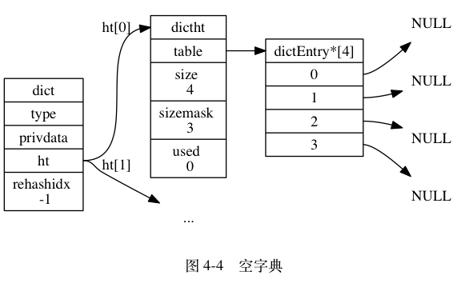
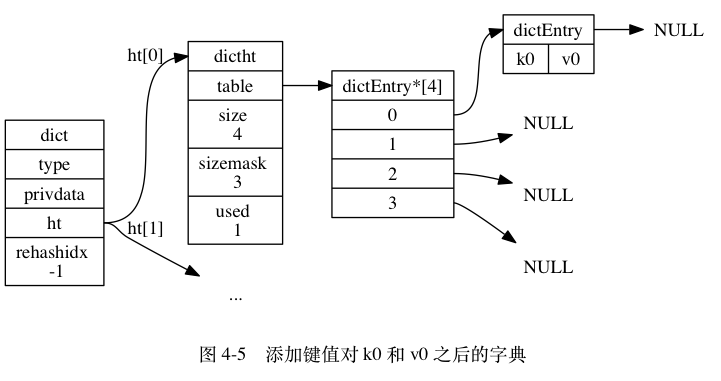

### Redis 哈希算法
当要将一个新的键值对添加到字典里面时， 程序需要先根据键值对的键计算出哈希值和索引值， 然后再根据索引值， 将包含新键值对的哈希表节点放到哈希表数组的指定索引上面。

Redis 计算哈希值和索引值的方法如下：

```c

# 使用字典设置的哈希函数，计算键 key 的哈希值
hash = dict->type->hashFunction(key);

# 使用哈希表的 sizemask 属性和哈希值，计算出索引值
# 根据情况不同， ht[x] 可以是 ht[0] 或者 ht[1]
index = hash & dict->ht[x].sizemask;
```



举个例子， 对于图 4-4 所示的字典来说， 如果我们要将一个键值对 k0 和 v0 添加到字典里面， 那么程序会先使用语句：

```c
hash = dict->type->hashFunction(k0);
```

计算键 k0 的哈希值。

假设计算得出的哈希值为 8 ， 那么程序会继续使用语句：

```c
index = hash & dict->ht[0].sizemask = 8 & 3 = 0;
```

计算出键 k0 的索引值 0 ， 这表示包含键值对 k0 和 v0 的节点应该被放置到哈希表数组的索引 0 位置上， 如图 4-5 所示。



当字典被用作数据库的底层实现， 或者哈希键的底层实现时， Redis 使用 MurmurHash2 算法来计算键的哈希值。