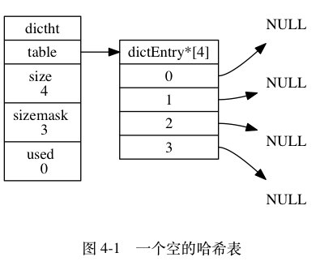

# 概述
全局哈希表，NIO，epoll_wait（timeout） 超时模型


## Redis SDS的实现

Redis 并没有直接使用C语言的字符串格式(即 '\0' 的风格) 而是自己构建可一个名为简单动态字符串的抽象类型，需要注意的是，SDS 仅仅在KV中被使用，在代码的日志等常量字符串中依旧使用的是字符串字面量

比如：

```sh
  redis > SET msg "hello, world" 
```

>   在Redis 的底层中 msg 也是一个SDS，"hello, world" 也是一个SDS


+ SDS 的数据结构如下 

  ```c
  struct sdshdr{
    // 记录buf中已使用的字节的数量
    int len;
    
    // 记录buf中未使用的字节的数量
    int free;
    
    // 字节数组用于保存字符串, buf的最后一位仍然是 '\0'
    char buf[];
  }
  ```

图 2-1 展示了一个 SDS 示例：

+ free 属性的值为 0 ， 表示这个 SDS 没有分配任何未使用空间。
+ len 属性的值为 5 ， 表示这个 SDS 保存了一个五字节长的字符串。
+ buf 属性是一个 char 类型的数组， 数组的前五个字节分别保存了 'R' 、 'e' 、 'd' 、 'i' 、 's' 五个字符， 而最后一个字节则保存了空字符 '\0' 。


除了用于保存数据库中的字符串之外，SDS还被用于缓冲区(buffer) 以及AOF模块中的缓冲区
SDS 中的buf的结尾处依然遵循C语言的传统，其尾部是 '\0' 这样做的好处是可以直接复用 C 语言的相关函数，而无需为SDS编写专门的函数，比如

  ```c
  printf("%s",s->buf)
  ```

  


+ C 语言的字符串并不适用于Redis的原因:
  1. C 字符串并不保存字符串的长度信息，获取其长度的时间复杂度为O(n) 而SDS的时间复杂度则为O(1)
  2. 除了获取字符串长度的时间复杂度高之外，C语言字符串容易带来缓冲区溢出的风险，比如在合并字符串 strcat 之前需要确保字符串的空间足够，否则就会出现缓冲区溢出的问题，但SDS则不会出现这个问题，当SDS不满足空间大小要求的时间，其会自动拓展至所需要的空间大小，然后才执行操作
  3. 减少修改字符串时带来的内存重分配问题，如果执行的C字符串增长操作，则必须先通过内存重分配来手动拓展空间，否则会出现缓冲区溢出的风险；如果执行的是缩短操作，那么进行内存重分配缩短空间，否则可能会出现内存泄漏的问题，而每次执行内存重分配则是一个非常耗时的操作。且频繁的进行内存重分配对于速度要求苛刻的Redis来说显然是不合适。
  4. 二进制安全性, 在使用Redis存储二进制数据的时候，不能强制要求使用 '\0' 作为结束符号，常见的文件，图片以及音频视频等等就不能，通过二进制安全，使得Redis的SDS可以保存二进制数据

  

## Redis 链表和链表节点的实现
每个链表节点使用一个 adlist.h/listNode 结构来表示：

```c
typedef struct listNode {

    // 前置节点
    struct listNode *prev;

    // 后置节点
    struct listNode *next;

    // 节点的值
    void *value;

} listNode;
```

多个 listNode 可以通过 prev 和 next 指针组成双端链表， 如图 3-1 所示。


虽然仅仅使用多个 listNode 结构就可以组成链表， 但使用 adlist.h/list 来持有链表的话， 操作起来会更方便：


```c
typedef struct list {

    // 表头节点
    listNode *head;

    // 表尾节点
    listNode *tail;

    // 链表所包含的节点数量
    unsigned long len;

    // 节点值复制函数
    void *(*dup)(void *ptr);

    // 节点值释放函数
    void (*free)(void *ptr);

    // 节点值对比函数
    int (*match)(void *ptr, void *key);

} list;
```

list 结构为链表提供了表头指针 head 、表尾指针 tail ， 以及链表长度计数器 len ， 而 dup 、 free 和 match 成员则是用于实现多态链表所需的类型特定函数：

+ dup 函数用于复制链表节点所保存的值；
+ free 函数用于释放链表节点所保存的值；
+ match 函数则用于对比链表节点所保存的值和另一个输入值是否相等。


图 3-2 是由一个 list 结构和三个 listNode 结构组成的链表：


Redis 的链表实现的特性可以总结如下：

+ 双端： 链表节点带有 prev 和 next 指针， 获取某个节点的前置节点和后置节点的复杂度都是 O(1) 。
+ 无环： 表头节点的 prev 指针和表尾节点的 next 指针都指向 NULL ， 对链表的访问以 NULL 为终点。
+ 带表头指针和表尾指针： 通过 list 结构的 head 指针和 tail 指针， 程序获取链表的表头节点和表尾节点的复杂度为 O(1) 。
+ 带链表长度计数器： 程序使用 list 结构的 len 属性来对 list 持有的链表节点进行计数， 程序获取链表中节点数量的复杂度为 O(1)。
+ 多态： 链表节点使用 void* 指针来保存节点值， 并且可以通过 list 结构的 dup 、 free 、 match 三个属性为节点值设置类型特定函数， 所以链表可以用于保存各种不同类型的值。


## Redis 的字典实现
Redis 的字典使用哈希表作为底层实现， 一个哈希表里面可以有多个哈希表节点， 而每个哈希表节点就保存了字典中的一个键值对。

接下来的三个小节将分别介绍 Redis 的哈希表、哈希表节点、以及字典的实现。

哈希表
Redis 字典所使用的哈希表由 `dict.h/dictht` 结构定义：

```c
typedef struct dictht {

    // 哈希表数组
    dictEntry **table;

    // 哈希表大小
    unsigned long size;

    // 哈希表大小掩码，用于计算索引值
    // 总是等于 size - 1
    unsigned long sizemask;

    // 该哈希表已有节点的数量
    unsigned long used;

} dictht;
```
+ table 属性是一个数组， 数组中的每个元素都是一个指向 dict.h/dictEntry 结构的指针， 每个 dictEntry 结构保存着一个键值对。
+ size 属性记录了哈希表的大小， 也即是 table 数组的大小， 而 used 属性则记录了哈希表目前已有节点（键值对）的数量。
+ sizemask 属性的值总是等于 size - 1 ， 这个属性和哈希值一起决定一个键应该被放到 table 数组的哪个索引上面。

图 4-1 展示了一个大小为 4 的空哈希表 （没有包含任何键值对）。



哈希表节点使用 dictEntry 结构表示， 每个 dictEntry 结构都保存着一个键值对：

```c
typedef struct dictEntry {

    // 键
    void *key;

    // 值
    union {
        void *val;
        uint64_t u64;
        int64_t s64;
    } v;

    // 指向下个哈希表节点，形成链表
    struct dictEntry *next;

} dictEntry;
```

+ key 属性保存着键值对中的键， 而 v 属性则保存着键值对中的值， 其中键值对的值可以是一个指针， 或者是一个 uint64_t 整数， 又或者是一个 int64_t 整数。
+ next 属性是指向另一个哈希表节点的指针， 这个指针可以将多个哈希值相同的键值对连接在一次， 以此来解决键冲突（collision）的问题。

举个例子， 图 4-2 就展示了如何通过 next 指针， 将两个索引值相同的键 k1 和 k0 连接在一起。


Redis 中的字典由 `dict.h/dict` 结构表示：

```c
typedef struct dict {

    // 类型特定函数
    dictType *type;

    // 私有数据
    void *privdata;

    // 哈希表
    dictht ht[2];

    // rehash 索引
    // 当 rehash 不在进行时，值为 -1
    int rehashidx; /* rehashing not in progress if rehashidx == -1 */

} dict;
```

type 属性和 privdata 属性是针对不同类型的键值对， 为创建多态字典而设置的：

type 属性是一个指向 dictType 结构的指针， 每个 dictType 结构保存了一簇用于操作特定类型键值对的函数， Redis 会为用途不同的字典设置不同的类型特定函数。
而 privdata 属性则保存了需要传给那些类型特定函数的可选参数。
```c
typedef struct dictType {

    // 计算哈希值的函数
    unsigned int (*hashFunction)(const void *key);

    // 复制键的函数
    void *(*keyDup)(void *privdata, const void *key);

    // 复制值的函数
    void *(*valDup)(void *privdata, const void *obj);

    // 对比键的函数
    int (*keyCompare)(void *privdata, const void *key1, const void *key2);

    // 销毁键的函数
    void (*keyDestructor)(void *privdata, void *key);

    // 销毁值的函数
    void (*valDestructor)(void *privdata, void *obj);

} dictType;
```

ht 属性是一个包含两个项的数组， 数组中的每个项都是一个 dictht 哈希表， 一般情况下， 字典只使用 ht[0] 哈希表， ht[1] 哈希表只会在对 ht[0] 哈希表进行 rehash 时使用。

除了 ht[1] 之外， 另一个和 rehash 有关的属性就是 rehashidx ： 它记录了 rehash 目前的进度， 如果目前没有在进行 rehash ， 那么它的值为 -1 。

图 4-3 展示了一个普通状态下（没有进行 rehash）的字典：


## 跳表

## 哈希表

