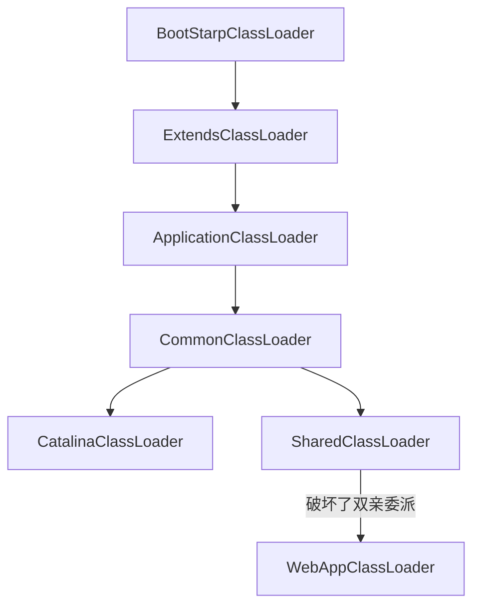

[toc]

## 1. JVM内存区域

JVM的内存划分为几个区域：

1. 线程共享的区域:

   Java堆内存：new 关键字创建的区域

   方法区: Class、常量、静态变量

   直接内存: ByteBuf

2. 线程独占的内存区域

   虚拟机栈: 虚拟机栈帧(局部变量表/操作数栈/动态连接/返回地址)

   本地方法栈:

   程序计数器: 

### 1.1 对象创建过程

1. 检查类是否已加载, 否则去加载Class
2. 为对象申请内存（指针碰撞、空闲列表），线程不安全，通过CAS实现线程安全的问题 或者TLAB (本地线程分配缓存)TLAB 会预先在线程中分配缓存，TLAB用完的时候才会触发重新申请内存，才需要同步锁定，可以通过-XX:+UserTLAB 参数设定
3. 初始化零值(不包含对象头)，初始化对象头 (hashCode、元数据信息、GC年龄，锁信息)
4. 执行init方法，即构造方法，赋值给引用

### 1.2 对象的内存布局以及访问

1. 对象头、实例数据、对其填充
2. 对象的访问通过两种方式： 
   + 本地变量表-> 句柄池 -> 实例池和方法区的类(对应移动，不改变本地变量的引用)
   + 本地变量表-> 实例池 -> 方法区的类


### 1.3 JAVA 内存的溢出

+ OutOfMemoryError： 堆内存溢出
+ StackOverflowError: 栈溢出
+ OutOfMemoryError: PermGen space 永久代移除

## 2、垃圾回收器

GC的三大问题： 哪些内存需要回收？ 什么时候回收？如何回收？

使用引用计数法和可达性分析可以判断变量是否需要回收！引用计数器无法解决循环引用的问题，一般使用可达性分析判断是否需要回收。可以作为 GC Roots的有: **方法区中的静态变量、常量、JNI引用的对象、以及本地变量表中引用的对象**

### 2.1 引用的方式
+ 强引用: 只要强引用还在，GC就不会回收该对象
+ 软引用: 没有有效的内存的时候则会回收，一般作为本地内存
+ 弱引用: 下次GC的时候就会回收，使用场景是ThreadLocal
+ 虚引用: 无法获取引用的值，一般用来实现堆外内存的管理

### 2.2 对象拯救
当对象准备回收的时候，Finalize() 方法会被调用，此变量会放置于F-Queue队列中，一个低优先级的线程会执行飞哪里则方法，但是可以在finalize方法中重新的进行强引用，可以拯救内存。但是finalize 方法只会执行一次，第二回收的之后直接回收。

>  如果 finalize 方法中执行了死循环等方法，很有可能导致 F-Queue队列中的其他执行卡死，造成整个内存回收机制崩溃。

### 2.3 方法区的回收

判断一个常亮是否是废弃常量很简单

+ 该类的所有实例都被回收
+ 加载该类的ClassLoader被回收
+ 该类对应的Class没有被引用

### 2.4 垃圾回收器算法

+ 标记-清除: 需要经历标记-清除过程，效率不高，容易产生不连续内存碎片
+ 复制: 将内存一分为二,其中一块内存用完时，将其中的存活的对象复制到另外一块，然后将其清空。这种方式适合频繁回收的情况，同时也会浪费50%的内存空间
+ 标记-整理: 回收后，将存在的对象向一端移动，然后清理掉边界之外的内存。适合回收不频繁的内存区域，适合老年代
+ 分代收集：将内存划分为新生代和老年代，新生代采用复制算法，老年代采用标记-整理算法

### 2.5 垃圾回收器
这里仅仅说明 HotSpot支持的垃圾回收器

#### 2.5.1 新生代垃圾回收器
+ Serial: 单线程，复制算法，需要 STW
+ ParNew: Serial: 回收器的多线程版本 
+ Parallel Scavenge: 多线程并行垃圾搜集器,复制算法，关注于吞吐量，而非停顿时间，JDK8 默认

#### 2.5.2 老年代垃圾回收器
CMS: （Concurrent Mark-Sweep）并发标记清除垃圾回收器，关注于停顿时间

+ Serial Old: 单线程版本, 采用标记-整理算法
+ Parallel Old: 多线程并行垃圾回收器，JDK8 默认


#### 2.5.4 CMS 详解
1. 初始标记: 需要STW,快速标记下能被GC Root关联的对象
2. 并发标记: 整理变动
3. 重新标记: 需要STW,补充标记初始标记期间导致变动的记录(同用户线程一起执行)
4. 并发清除: 

---


1. 低延迟的收集器：几乎没有长时间的停顿，应用程序只在Minor gc以及后台线程扫描老年代的时候发生极其短暂的停顿
2. 更高的CPU使用：必须有足够的CPU资源用于运行后台的垃圾收集线程
3. CMS收集器对老年代收集的时候，不再进行任何压缩和整理的工作，意味着老年代随着应用的运行会变得**碎片化**
4. 碎片过多会影响大对象的分配，虽然老年代还有很大的剩余空间，但是没有连续的空间来分配大对象，这时候就会触发*Full GC*
5. 无法处理浮动垃圾，只能等待下一次清理

#### 2.5.4 G1 垃圾回收器
G1(Garbage First)垃圾收集器是当今垃圾回收技术最前沿的成果之一。早在JDK7就已加入JVM的收集器大家庭中，成为HotSpot重点发展的垃圾回收技术。同优秀的CMS垃圾回收器一样，G1也是关注最小时延的垃圾回收器，也同样适合大尺寸堆内存的垃圾收集，官方也推荐使用G1来代替选择CMS。

1. **G1收集器的最大特点**

- G1最大的特点是引入分区的思路，弱化了分代的概念。
- 合理利用垃圾收集各个周期的资源，解决了其他收集器甚至CMS的众多缺陷。

**2. G1相比较CMS的改进**
- 算法： G1基于标记-整理算法, 不会产生空间碎片，分配大对象时不会无法得到连续的空间而提前触发一次FULL GC。
- 停顿时间可控： G1可以通过设置预期停顿时间（Pause Time）来控制垃圾收集时间避免应用雪崩现象。
- 并行与并发：G1能更充分的利用CPU，多核环境下的硬件优势来缩短stop the world的停顿时间。

**3. CMS和G1的区别**
- CMS中，堆被分为PermGen，YoungGen，OldGen；而YoungGen又分了两个survivo区域。在G1中，堆被平均分成几个区域(region)，在每个区域中，虽然也保留了新老代的概念，但是收集器是以整个区域为单位收集的。
- G1在回收内存后会马上同时做合并空闲内存的工作、而CMS默认是在STW（stop the world）的时候做。
- G1会在Young GC中使用、而CMS只能在O区使用。

**4. G1收集器的应用场景**
G1垃圾收集算法主要应用在多CPU大内存的服务中，在满足高吞吐量的同时，尽可能的满足垃圾回收时的暂停时间。

就目前而言、CMS还是默认首选的GC策略、可能在以下场景下G1更适合：

- 服务端多核CPU、JVM内存占用较大的应用（至少大于4G）
- 应用在运行过程中会产生大量内存碎片、需要经常压缩空间
- 想要更可控、可预期的GC停顿周期，防止高并发下应用雪崩现象

### 2.6 内存分配策略
1. 对象优先在Eden区域
2. 大对象直接进入老年代
3. 长期存活对象进入老年代
4. 空间分配担保： 在发生MinorGC之前，VM会检查下老年代的最大连续空间是否大于新生代对象总大小，如果大于则确保Minor是安全的，否则判断是否允许担保失败，是的话则判断老年代连续空间是否大于历次MinorGC存活对象的平均值，是的话则冒险执行MinorGC，否则则执行FullGC

## 3、虚拟机监控方式
1. JPS 查询本地JVM的进程PID
2. Jstat 查询JVM的运行状态信息: 内存，GC，JIT，类加载等
   + -class 查询类的情况
   + -gc | -gcutil | -gcnew | -gcold 查询GC情况
3. Jinfo 查询VM的参数信息(JDK8 不可用)
4. Jmap 生成堆 Dump 文件 （JDK8 不可用）
5. Jhat 分析堆转存文件 
6. Jstack VM 堆栈跟踪工具，生成线程快照
7. JConsole Java监视与管理控制台
8. JVisualVM 多合一故障处理工具，支持插件
9. 第三方监控工具 Jprofile/Arthas

## 4、类文件结构
Class文件的结构如下:
1. (u4)魔数: OXCAFEBABE
2. (u2)主版本号和(u2)次版本号
3. (u2)常量池常量个数 +  常量池信息
4. (u2) 访问标记
5. (u2)当前类标记 + (u2) 父类标记 + (u2 * n)接口类标记 + (u2 * n) 接口字面量
6. (u2) 字段数量 + 字段占用空间
7. (u2) 方法数量 + 方法占用空间
8. (u2) 属性数量 + 属性占用空间 (Code,异常表等信息)

## 5、类加载机制

### 5.1 类加载机制的时候
1. 遇到new,getStatic,putstatic,invokieStatic这四条指令的时候
2. 使用反射机制对类进行反射调用的时候
3. 当初始化一个类，但是父类没有被初始化的时候，会先初始化父类
4. 虚拟机启动的时候，会加载Main方法所在的类
5. JDK1.7 以上使用方法句柄获取REF_getStatic,REF_putStatic以及REF_invokeStatic的时候，句柄所在的类没有初始化的时候会触发初始化

> 1. 调用子类的静态字段不会触发父类的初始化
> 2. 初始化一个类的数组的时候，不会触发这个类的初始化，其创建指令为 newarray
> 3. 调用某类的常亮的时候，不会触发初始化类，这是因为常量传播优化

### 5.2 类加载的过程
1. 加载->验证->准备->解析->初始化->使用->卸载
2. 加载: 从存储介质中加载Class文件
3. 验证: 验证class文件的魔数，版本号等信息
4. 准备: 为类和静态变量分配内存，并初始化零值
5. 解析: 将符号引用转换为直接引用
6. 初始化: 搜集类的代码块生成 \<cinit\>方法，执行之
7. 使用: 使用 new 字段触发对象的创建流程: 检查类是否加载,申请内存空间，执行\<init>方法，赋值引用
8. 卸载


### 5.3 类加载器

类加载在层次划分，OSGI，热部署以及代码加密方面上应用密切。比较两个类是否相等的前提是两个实例由同一个类加载器加载，这里的相等包括地址，equal,instance.


#### 5.3.1 双亲委派机制

+ 启动类加载器: 加载`<JAVA_HOME>/lib`目录下的文件，C++编写，无法直接引用
+ 拓展类加载器: 加载`<JAVA_HOME>/lib/ext`目录下的文件或者`java.ext.dirs` 指定的目录文件
+ 应用类加载器: 加载ClassPath目录下的文件，一般是默认的类加载器
+ 实现的目的是防止Java基本的类型体系被破坏


#### 5.3.1 自定义类加载器

```java
static class MyClassLoader extends ClassLoader {


    /**
     * 如果想要破坏双亲委派机制，那么久需要重写 loadClass 方法，其父类实现了双亲委派机制
     */
    @Override
    protected Class<?> loadClass(String name, boolean resolve) throws ClassNotFoundException {
        return super.loadClass(name, resolve);
    }


    /**
     * loadClass() 方法中使用的了模板方法的设计模式，当需要子类加载器加载类的时候，会执行findClass方法
     */
    @Override
    protected Class<?> findClass(String name) throws ClassNotFoundException {
        return super.findClass(name);
    }
}
```


#### 5.3.3 破坏双亲委派机制

+ 兼容:JDK1.2 兼容JDK1.1的时候破坏了

+ SPI: 服务提供者接口
+ 动态性: 代码热加载

#### 5.3.4 Tomcat的类加载机制




Tomcat的类加载器说明

+ CommonClassLoader: 以ApplicationClassLoader为父类加载器, 是位于Tomcat 应用服务器顶层的公用类加载器,默认是加载$CATALINE_HOME/lib 下的JAR包
+ CatalinaClassLoader: 以Common Class Loader 为父加载器.用于加载 Tomcat 应用服务器本身的
+ SharedClassLoader: 以Common 为父加载器,是所有web应用的父加载器.
+ WebAppClassLoader: 每个独立的Context(web应用)都使用独立的ClassLoader,其是破坏双亲委派机制的核心，只有其无法加载类的时候才会委托给父类加载器加载

tomcat为什么要实现自己的类加载器模块?这是因为有几个问题Tomcat需要解决

1. 不同Web中依赖同一个JAR不同版本怎么办? 默认的类加载器只能加载一个类型
   
> 默认的类加载器根据全类名加载，不处理版本问题，因此需要实现自己的类加载器

2. Web容器也有自己的类库，不能和其他web容器和程序类搞混
   
> 这个上问题1类似

3. JSP 要支持热修改，怎么解决？

   > 对于JSP来说，其也是class文件，如果使用双亲委派机制，上层父类加载器认为其已经存在，不会再次加载，所以需要实现自己的类加载器


## 类执行机制
栈帧： 适用于支撑虚拟机进行方法调用和方法执行的数据结构。他是虚拟机运行时候虚拟机栈的栈元素的数据结构。栈帧保存着局部变量表，操作数栈，动态连接以及返回地址，每个方法调用或者返回都对应着栈帧的入栈和出栈。

### 动态分派与静态分派
JVM是一种静态多分派动态单分派的语言。

## 常用参数

1. -XX:+/-UseTLAB: 使用TLAB的方式

2. -XX:+HeapDumpOnOutOfMemoryError 当OOM时，dump堆内存

3. -Xms20m: 初始化堆内存大小

4. -Xmx20M: 最大堆内存大小

5. -Xss20M: 设置栈内存大小

6. -Xmn:256M 新生代大小

7. -Xss:1M 设置每个线程栈大小

8. -XX:NewSize=256M 设置新生代初始大小

9. -XX:PermSize & -XX:MaxPermSize: 设置永久代大小

10. -XX:MaxDireactMemorySize 设置最大直接内存大小

11. -Xnoclassgc 控制是否回收class

12. -XX:-PrintGC 每次GC时打印相关信息

13. -XX:-PrintGCDetails 每次GC时打印详细信息

14. -XX:MaxTenuringThreshold=20 最大交互20次后，进入老年代

    