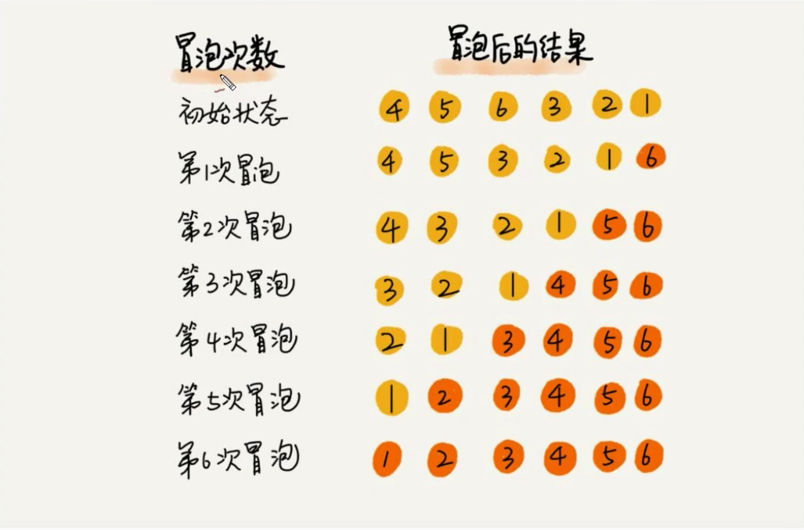
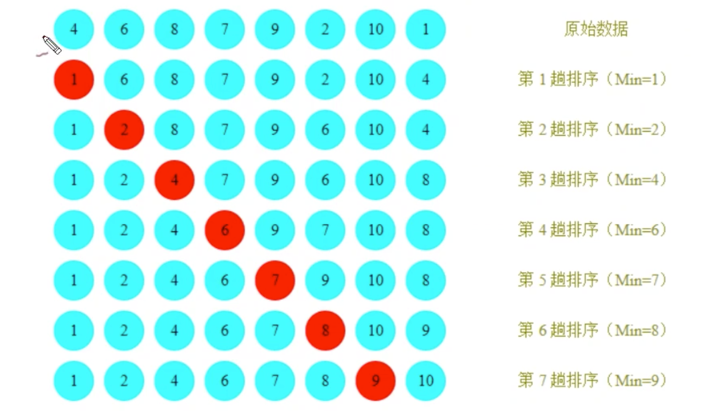
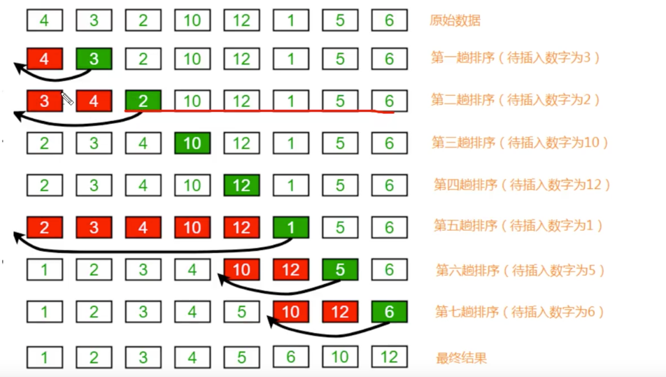
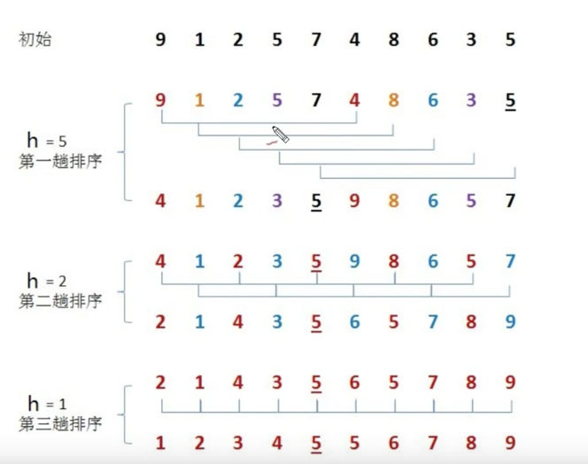
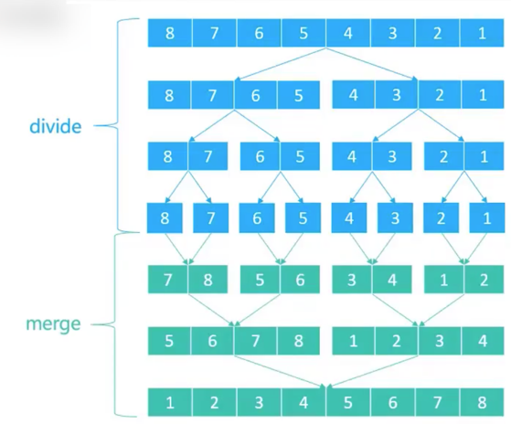
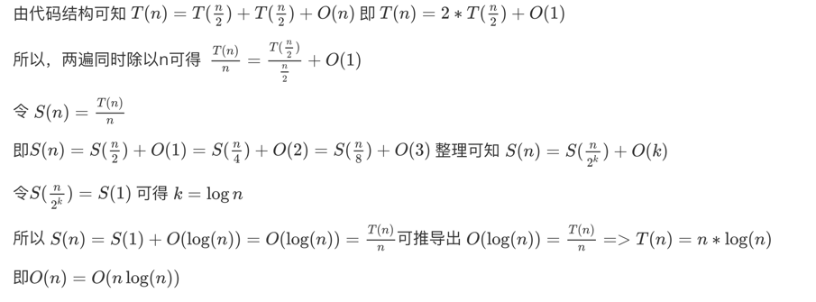

> 本仓库仅仅记录理论知识，排序算法的实现参考其他仓库的代码
> + [Github 仓库](https://github.com/taoes/architect/blob/master/struct/src/main/java/com/zhoutao123/sort/AnExampleOfJavaSort.java)
> + [Gitee 仓库](https://gitee.com/taoes_admin/architect/blob/master/struct/src/main/java/com/zhoutao123/sort/AnExampleOfJavaSort.java)
## 简单排序算法

#### 冒泡排序法

+ 核心思想: 将第i个数字和第i+1个数字比较，如果比之大，那么则交换，每一次遍历完成后，最后一个为最大数
+ 时间复杂度: O(n^2)

#### 选择排序法

+ 核心算法： 从中选出最小的数据，放在头部相应的位置，然后从剩下的部分中在选出最小的数据，依次类推，完成排序
+ 时间复杂度: O(n^2)

#### 插入排序

+ 核心算法: 假定前面的是有序的，拿到新的数据后依次向左插入，直到遇到比他小的数据后停止，然后继续插入下个数据
+ 时间复杂度: O(n^2)

## 高级排序算法

#### 希尔排序

+ 核心算法: 分组-插入排序
+ 时间复杂度:  O(n^(1.3-2))

#### 归并排序

+ 核心算法: 分治算法
+ 时间复杂度: O(n * lgn)

+ 时间复杂度计算

#### 堆排序
+ 核心算法: 是对插入排序的优化，优化了查找最大数的方式，通过构建最大堆的方式在堆的订单找到最大值，然后和最后一位交换
+ 时间复杂度: O(n * lgn)
