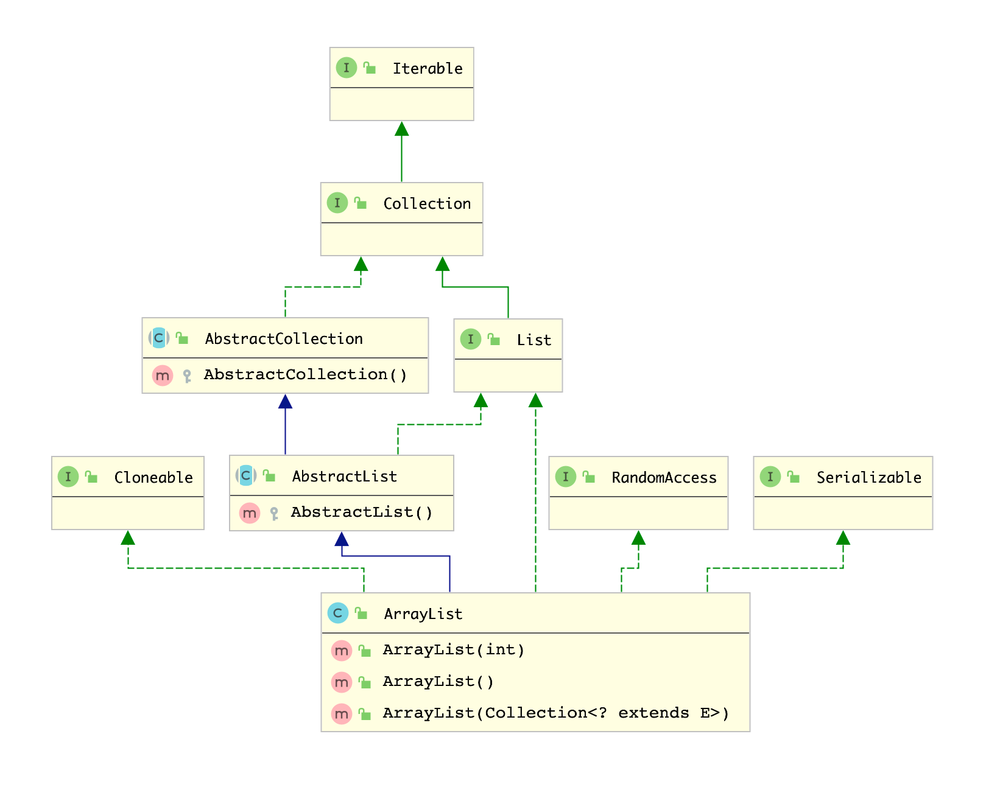

ArrayList 是我们在日常开发中经常使用的一个类，其位于 `java.util` 包下，底层使用了数组来实现，在继承关系上如下所示




- [x] 父类是Collect，说明其是对象的容器
- [x] 继承了 RandomAccess 表明可以随机访问
- [x] 继承Serializable标识可以被序列化
- [x] 继承Cloneable 说明可以被克隆


<a name="kUcEJ"></a>
## 1、ArrayList的创建


如上图所示，ArrayList 具有3个构造方法，分别有 `ArrayList()` , `ArrayList(int caption)` 以及 `ArrayList(Collection<? extend E>)` 笔者这里分别来讲述这三个构造方法的源码。


无参的构造方法，使用默认的空集合返回，当调用无参的构造方法之后，返回的是一个空的数组
```java
    private static final Object[] DEFAULTCAPACITY_EMPTY_ELEMENTDATA = {};

    public ArrayList() {
        this.elementData = DEFAULTCAPACITY_EMPTY_ELEMENTDATA;
    }
```


只有一个参数的构造方法，传递的整数类型表示ArrayList集合底层的数据的size,定义如下 `this.elementData = new Object[initialCapacity];`  可以看到当 _initialCapacity > 0 _的时候会创建长度为_initialCapacity的_数组，等于0则和会和无参构造一样，构造一个空的数组，小于0则抛出非法的参数异常。
```java
    public ArrayList(int initialCapacity) {
        if (initialCapacity > 0) {
            this.elementData = new Object[initialCapacity];
        } else if (initialCapacity == 0) {
            this.elementData = EMPTY_ELEMENTDATA;
        } else {
            throw new IllegalArgumentException("Illegal Capacity: "+
                                               initialCapacity);
        }
    }
```


传递Collection的方法，首先将参数集合转换为数组，然后判断数组的长度，等于0则返回引用一个的空数组，不等于0则进行数组的拷贝，则定义如下:
```java
    public ArrayList(Collection<? extends E> c) {
        elementData = c.toArray();
        if ((size = elementData.length) != 0) {
            // c.toArray might (incorrectly) not return Object[] (see 6260652)
            if (elementData.getClass() != Object[].class)
                elementData = Arrays.copyOf(elementData, size, Object[].class);
        } else {
            // replace with empty array.
            this.elementData = EMPTY_ELEMENTDATA;
        }
    }
```


<a name="A0kgb"></a>
## 2、ArrayList 新增对象
ArrayList 继承 Collection, 因此可以使用 `add` 方法向其中添加对象。 `add(E e)` & `add(int index,E e)` 是一组重载的方法，表示向数组的尾部添加元素以及向指定索引位置添加元素，定义如下:


```java
   public boolean add(E e) {
        // 确保内部容量够用，如果不够用，会自动扩容
        ensureCapacityInternal(size + 1);  // Increments modCount!!
        // 将元素赋值给数组的末尾
        elementData[size++] = e;
        return true;
    }

    private void ensureCapacityInternal(int minCapacity) {
        // 计算最小容量
        ensureExplicitCapacity(calculateCapacity(elementData, minCapacity));
    }

    private static int calculateCapacity(Object[] elementData, int minCapacity) {
        // 如果集合是默认的空集合的话，返回默认的DEFAULT_CAPACITY
        if (elementData == DEFAULTCAPACITY_EMPTY_ELEMENTDATA) {
            return Math.max(DEFAULT_CAPACITY, minCapacity);
        }
        return minCapacity;
    }

    private void ensureExplicitCapacity(int minCapacity) {
        modCount++;
        // 如果超出 elementData 也就是底层数组的长度，则扩容
        if (minCapacity - elementData.length > 0)
            grow(minCapacity);
    }

    private void grow(int minCapacity) {
        // 可以看到 newCapacity = oldCapacity + oldCapacity/2,也就是扩容为原来的1.5倍
        int oldCapacity = elementData.length;
        int newCapacity = oldCapacity + (oldCapacity >> 1);
        if (newCapacity - minCapacity < 0)
            newCapacity = minCapacity;
        if (newCapacity - MAX_ARRAY_SIZE > 0)
            newCapacity = hugeCapacity(minCapacity);
        // 将原来的数据拷贝到新的数组中
        elementData = Arrays.copyOf(elementData, newCapacity);
    }
```
从上面的代码我们可以知道，使用 `new ArrayList()` 方法创建集合的时候，其数组是空集合，只有在第一次add的时候，才会进行扩容。


`add(int index,E e)` 属于add的一个重载方法，表示想指定位置添加元素，其实现源码如下


```java
    public void add(int index, E element) {
        // 检查给定的索引是够正确，大于等于0，小于等于数组的长度
        rangeCheckForAdd(index);

       	// 和之前一样，确保容量够用
        ensureCapacityInternal(size + 1);  // Increments modCount!!
        // 拷贝移动数组
        System.arraycopy(elementData, index, elementData, index + 1,
                         size - index);
        elementData[index] = element;
        size++;
    }
```


> 批量新增也是类似的方式，读者可以自行查看源码，学会分析源码


<a name="ipJiJ"></a>
## 3、ArrayList 移除元素


```java
    public E remove(int index) {
        // 检查给定的索引范围是否正确
        rangeCheck(index);

        modCount++;
        E oldValue = elementData(index);

        int numMoved = size - index - 1;
        
        // 如果移动的不是最后一个，则进行数组拷贝
        if (numMoved > 0)
            System.arraycopy(elementData, index+1, elementData, index,
                             numMoved);
        // 将最后一个设置为null，并减少size
        elementData[--size] = null; // clear to let GC do its work
        return oldValue;
    }
```


**从上面的代码我们可以知道，在元素移除的时候并没有缩小数组的长度（size 并不是数组的length，其只是一个长度的标识），仅仅是将后面的数据向前排列，然后将最后一个元素设置为NULL，然后等待GC。**


元素的移除还有另外一个重载的方法 `remove(Object o)` 


```java
    public boolean remove(Object o) {
        // 如果元素等于null，循环找到元素中等于null的元素，然后fastRemove
        // 不为null，则判断是否等于数组上指定索引的元素，等于的话则移除
        if (o == null) {
            for (int index = 0; index < size; index++)
                if (elementData[index] == null) {
                    fastRemove(index);
                    return true;
                }
        } else {
            for (int index = 0; index < size; index++)
                if (o.equals(elementData[index])) {
                    fastRemove(index);
                    return true;
                }
        }
        return false;
    }

    private void fastRemove(int index) {
        modCount++;
        int numMoved = size - index - 1;
        if (numMoved > 0)
            System.arraycopy(elementData, index+1, elementData, index,
                             numMoved);
        elementData[--size] = null; // clear to let GC do its work
    }
```


- 从上面的代码可以分析的得出，_**只要发现当前元素等于目标元素的则立刻停止删除，删除之后并不会继续遍历完，所以每次只会删除一个元素**_，即，假如集合为 `[1,2,3,null,4,null,5]` 调用方法 remove(null) 之后，集合将变为 `[1,2,3,4,null,5]` ,而不是`[1,2,3,4,5]`


<a name="Y2nCk"></a>
## 4、ArrayList 清空集合


```java
    public void clear() {
        modCount++;

        // clear to let GC do its work
        for (int i = 0; i < size; i++)
            elementData[i] = null;

        size = 0;
    }
```
可以看到clean() 方法是将每个索引的对应的元素均设置为null，设置为null后，将集合的size设置为0，注意，此时数组elementData=length 仍然不等于0，只是各个位置上的引用均为null
