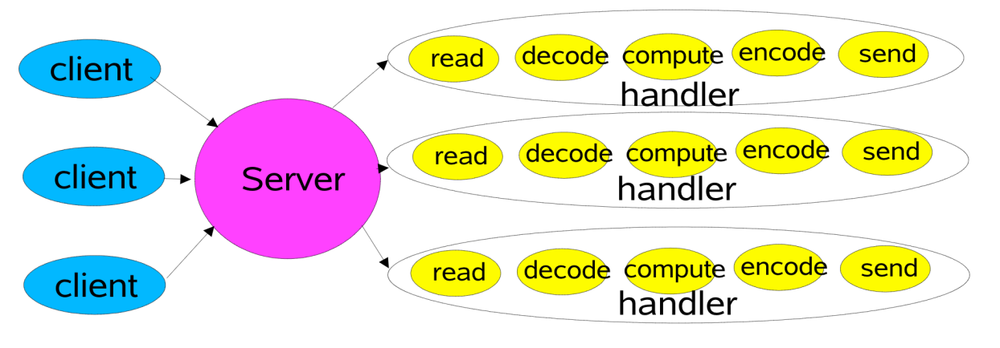
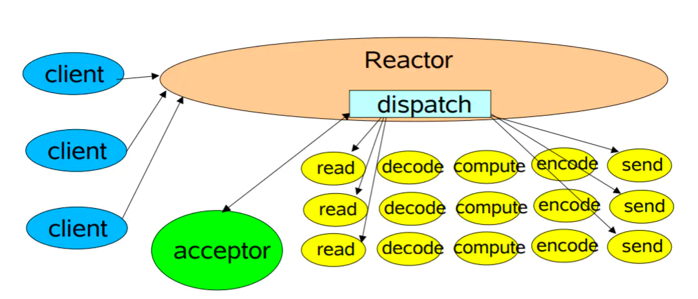

<br />网络通信的基本模型是C/S模式即 客户端-服务端 模式，客户端通过和服务端建立连接实现通信。因此服务端绑定某个端口, 并监听此端口的连接信息，在传统的BIO线程模型中 ServerSocket
负责绑定IP和端口，监听连接；Socket则负责发起连接操作，双方在建立连接之后等待数据传输。<br />
<br />在Java的网络通信模型中提供了BIO(阻塞IO)， NIO(新IO或者非阻塞IO) 以及 AIO (异步IO)，下面笔者将会对这三种网络IO模型做一个简单的阐述。<br />

<a name="21ZIA"></a>

## BIO 阻塞IO

<br />BIO操作在每次接收到连接请求的时候都会进行新的线程的创建，而线程则又是系统中非常珍贵的资源，因此BIO适合连接数很少的应用程序，代码简单易懂。其基础架构模型如下<br />
<br />
<br />

```java
    ServerSocket socket=new ServerSocket();
        socket.bind(new InetSocketAddress(9090));
        while(true){
        // 阻塞操作，等待连接
        Socket accept=socket.accept();
        // 接收到连接后创建线程处理数据
        new Thread(
        ()->{
        try(InputStream stream=accept.getInputStream()){
        BufferedReader reader=new BufferedReader(new InputStreamReader(stream));
        String s=reader.readLine();
        System.out.println("接收数据:"+s);
        }catch(IOException e){
        e.printStackTrace();
        }
        })
        .start();
        }
```

<br />在接收到大量连接的请示，程序会创建大量的线程，而线程则是系统中非常重要的资源，创建大量的线程可能会造成系统卡顿等问题。因此创建了使用线程池优化的方案，但是即使使用线程池也没有从本质上解决大量请求的问题。<br />

```java
private void handleBIOWithThreadPool()throws IOException{
        ExecutorService executor=Executors.newFixedThreadPool(10);
        ServerSocket socket=new ServerSocket();
        socket.bind(new InetSocketAddress(9091));
        while(true){
        Socket clientSocket=socket.accept();
        executor.submit(new SocketTask(clientSocket));
        }
        }

// 线程池任务
static class SocketTask implements Runnable {

    private Socket socket;

    public SocketTask(Socket socket) {
        this.socket = socket;
    }

    @Override
    public void run() {
        try (InputStream stream = this.socket.getInputStream()) {
            BufferedReader reader = new BufferedReader(new InputStreamReader(stream));
            String result = reader.readLine();
            System.out.println("接收到数据:" + result);
        } catch (IOException e) {
            e.printStackTrace();
        }
```

<a name="1f38f0ef"></a>

##  

<a name="ABjCU"></a>

## NIO 非阻塞IO

<br />因为BIO的性能问题，从Java1.4 开始 JDK提供了NIO模型，**NIO是一种同步非阻塞的IO操作模型, ****在Linux操作系统中NIO基于Epoll模型实现高效的IO操作。**
著名的网络IO编程框架Netty底层的实现就是依赖于NIO。<br />
<br />其主要依赖一下三个操作方法<br />

1. epoll_create 创建epoll线程模型,底层是epoll示例与红黑树模型
1. epoll_ctl 向epoll实例中注册需要监听的文件描述符，文件描述符以红黑树的行书保存
1. epoll_wait(timeout) 等待epoll模型中出现时间，比如连接事件以及可读事件

<br />但是在Linux 2.4 之前，Linux系统一直使用的select线程模型，而非epoll模型。而 select模型与epoll模型最大的区别是:<br />

- select 在接收收到注册的时间后，需要遍历所有的连接，从中过滤出有效的连接才能进行处理，这对存在大量连接，但是活跃的连接很少的情况下效率非常低。
- epoll 则需要要在连接的时候想 Selector 注册感兴趣的事件，当事件触发的时候(系统中断)，则将其移到另外一个集合中，业务系统仅仅需要通过遍历此集合即可，而非遍历大量的Channel，epoll以此来提高效率。

> 对于Windows操作系统而言，JavaNIO使用的线程模式是闭源的 win2sock, epoll 是 Linux 专属的线程模型



下面的代码展示了NIO的基础架构，在新的连接创立后，将channel添加集合中，每次需要遍历所有的连接即可，解决了BIO每次都需要创建新的连接的线程的问题，但此架构并没有解决大量请求中只有一部分有数据传输的场景。读者可以想象一下，有10W个连接，但是仅仅只有10个连接传输数据，那么此模型的代码需要遍历10W个连接，这可能就会造成有数据传输的连接的性能问题。

```java
    ServerSocketChannel channel=ServerSocketChannel.open();
        channel.bind(new InetSocketAddress(9091));
        channel.configureBlocking(false);
        System.out.println("服务启动成功.....");
        while(true){
        SocketChannel accept=channel.accept();
        if(accept!=null){
        System.out.println("连接成功");
        accept.configureBlocking(false);
        channelList.add(accept);
        }

        // FIXME: 需要处理所有的连接，连接越多性能越差，每次循环有大量的空转操作
        Iterator<SocketChannel>iterator=channelList.iterator();
        while(iterator.hasNext()){
        SocketChannel socketChannel=iterator.next();
        ByteBuffer buffer=ByteBuffer.allocate(128);
        int read=socketChannel.read(buffer);
        if(read>0){
        System.out.println("接收到数据:"+new String(buffer.array()));
        }else if(read==-1){
        System.out.println("连接断开");
        iterator.remove();
        }
        }
        }
```

<br />那么这种问题有什么好的解决方案呢？epoll
为我们提供了一个高效的解决方案，在系统接收到有效的数据的时候，将之放到另外一个集合中，业务系统只需要判断这个集合就可以，不需要遍历所有的连接，实现了高效处理的网络通信模型。下面的代码中展示了基于此模式的网络通信模型

```java
private static void nio()throws IOException{

        // 创建服务端channel，这里的底层实现是 epoll_create(int) 函数
        ServerSocketChannel channel=ServerSocketChannel.open();
        channel.bind(new InetSocketAddress(9090));
        channel.configureBlocking(false);

        // Selector 多路复用器 ep0ll
        Selector selector=Selector.open();

        // 注册对连接事件的监听，当有新的连接连接成功的时候，会将该channel放到活跃的集合中
        channel.register(selector,SelectionKey.OP_ACCEPT);

        while(true){
        // 阻塞需要等待的事件发生,目前已注册了 OP_ACCEPT 事件以及 OP_READ
        // 这里的底层实现是 epoll_wait() 函数
        selector.select();

        // 获取所有活跃的集合，准备遍历
        Set<SelectionKey>keys=selector.selectedKeys();
        Iterator<SelectionKey>iterator=keys.iterator();


        while(iterator.hasNext()){
        SelectionKey key=iterator.next();

        // 如果该事件是连接成功的消息的事件
        if(key.isAcceptable()){
        ServerSocketChannel serviceChannel=(ServerSocketChannel)key.channel();
        SocketChannel clientChannel=serviceChannel.accept();
        clientChannel.configureBlocking(false);
        serviceChannel.register(selector,SelectionKey.OP_READ);
        System.out.println("客户端连接成功!");
        continue;
        }

        // 如果该事件是有新的数据传输过来
        if(key.isReadable()){
        SocketChannel clientChannel=(SocketChannel)key.channel();
        ByteBuffer buffer=ByteBuffer.allocate(128);
        int len=clientChannel.read(buffer);
        if(len>0){
        System.out.println("接收到数据:"+new String(buffer.array()));
        }else if(len==-1){
        System.out.println("连接断开");
        clientChannel.close();
        }
        }


        // 处理完成后需要移除，防止下次重复处理
        iterator.remove();
        }
        }
        }
```

<a name="tdePI"></a>

## AIO 异步IO

<br />AIO全称 AsynchnorousIO 操作，AIO是一种异步非阻塞的IO模型，其适用于连接数比较多且连接比较长（重操作）的架构，比较相册服务器，充分调用OS参与并发操作，编程比较复杂，jdk7开始支持AIO。<br />
<br />AIO的基础操作代码非常简单，仅仅关注与数据的读写，而 `AsynchronousHandler` 则是自定的读写操作，当Channel 数据读写操作完成的时候，会触发此类的对应方法

```java
class AIOService implements Runnable {

    public AsynchronousServerSocketChannel channel;

    private void init() throws IOException {

    }

    @Override
    public void run() {
        try {
            channel = AsynchronousServerSocketChannel.open();
            channel.bind(new InetSocketAddress(9090));
            channel.accept(this, new AsynchronousHandler());

            // 由于AIO是一种非阻塞的IO模型，因此这里需要阻塞线程
            TimeUnit.HOURS.sleep(Integer.MAX_VALUE);
        } catch (Exception e) {
            System.out.println("AIO 服务启动出现异常");
            e.printStackTrace();
        }
    }
}
```

<br />AsynchronousHandler 的定义如下

```java
class AsynchronousHandler implements CompletionHandler<AsynchronousSocketChannel, AIOService> {

    @Override
    public void completed(AsynchronousSocketChannel socketChannel, AIOService attachment) {
        // 重点: 重新监听
        attachment.channel.accept(attachment, this);

        // 读取数据
        ByteBuffer buffer = ByteBuffer.allocate(1024);

        // 异步的读取数据
        socketChannel.read(buffer, buffer, new CompletionHandler<Integer, ByteBuffer>() {
            // 当读取数据完成的时候调用此方法
            @Override
            public void completed(Integer result, ByteBuffer attachment) {
                attachment.flip();
                byte[] bytes = new byte[attachment.remaining()];
                attachment.get(bytes, 0, attachment.remaining());
                System.out.println("客户端:" + new String(bytes, StandardCharsets.UTF_8));

                SimpleDateFormat format = new SimpleDateFormat("yyyy-MM-dd HH:mm:ss");
                String currentTime = format.format(new Date());
                ByteBuffer wBuffer = ByteBuffer.wrap(currentTime.getBytes());
                wBuffer.put(currentTime.getBytes());
                wBuffer.flip();
                socketChannel.write(wBuffer);
                System.out.println("发送数据完成");
            }

            @Override
            public void failed(Throwable exc, ByteBuffer attachment) {
                System.out.println("读取数据出现异常");
                exc.printStackTrace();
            }
        });

    }

    @Override
    public void failed(Throwable exc, AIOService attachment) {
        System.out.println("连接Channel出现异常");
        exc.printStackTrace();

    }
}
```

<br />其客户端的定义已非常简单，代码的释义已经在注释中说明<br />

```java
public static void main(String[]args)throws IOException,ExecutionException,InterruptedException{
        AsynchronousSocketChannel channel=AsynchronousSocketChannel.open();
        Future<Void>connect=channel.connect(new InetSocketAddress(9090));

        // 等待连接成功
        while(!connect.isDone()){
        TimeUnit.SECONDS.sleep(1);
        }

        System.out.println("连接Socket成功....");

        Scanner scanner=new Scanner(System.in);
        while(true){
        // 从键盘中输入数据
        String nextLine=scanner.nextLine();
        if("exit".equalsIgnoreCase(nextLine)){
        break;
        }
        ByteBuffer buffer=ByteBuffer.allocate(1024);
        buffer.put(nextLine.getBytes(StandardCharsets.UTF_8));
        buffer.flip();
        channel.write(buffer);
        System.out.println("客户端:"+nextLine);


        // 等待读取数据
        ByteBuffer rBuffer=ByteBuffer.allocate(1024);
        channel.read(rBuffer);
        rBuffer.flip();

        // 读取有效的数据
        byte[]bytes=new byte[rBuffer.remaining()];
        rBuffer.get(bytes,0,rBuffer.remaining());
        System.out.println("服务端:"+new String(bytes,StandardCharsets.UTF_8));
        }
        channel.close();
        System.out.println("系统:连接已关闭");
        }
```

<br />

> 本文中的代码仓库位于 [https://gitee.com/taoes_admin/architect/tree/master/network/src/main/java/com/zhoutao123/architect/network](https://gitee.com/taoes_admin/architect/tree/master/network/src/main/java/com/zhoutao123/architect/network)

