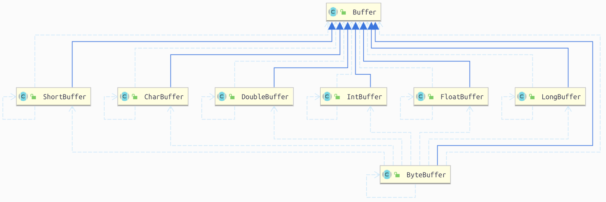
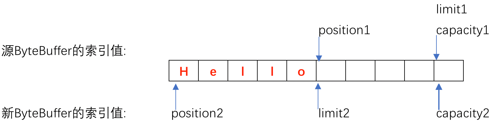
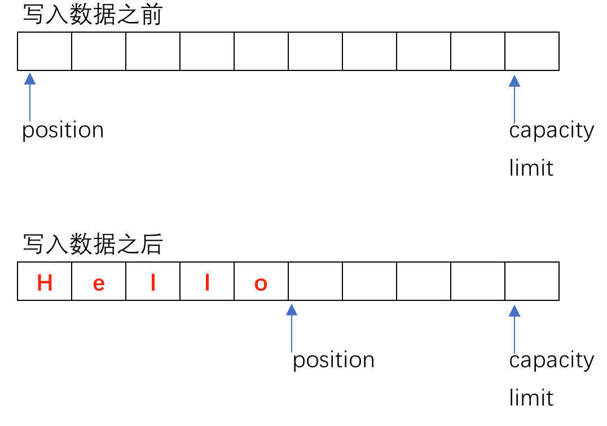
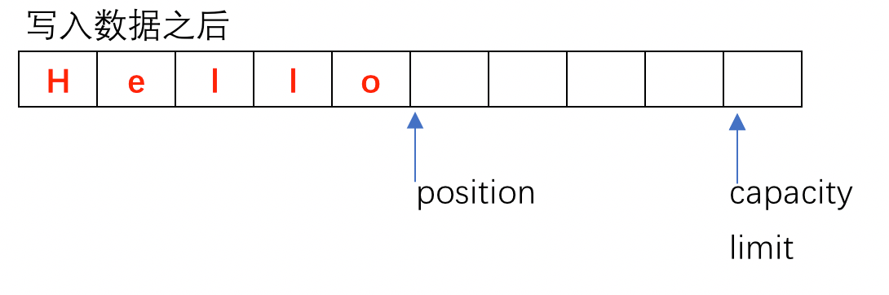
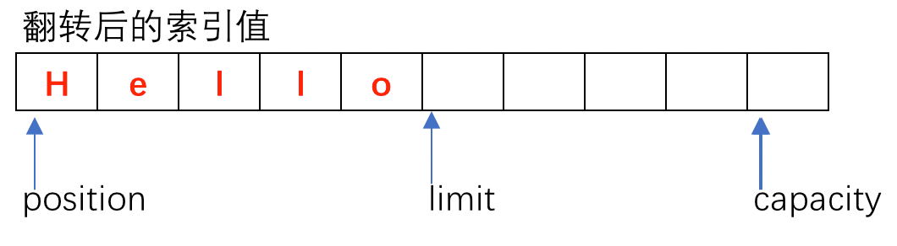
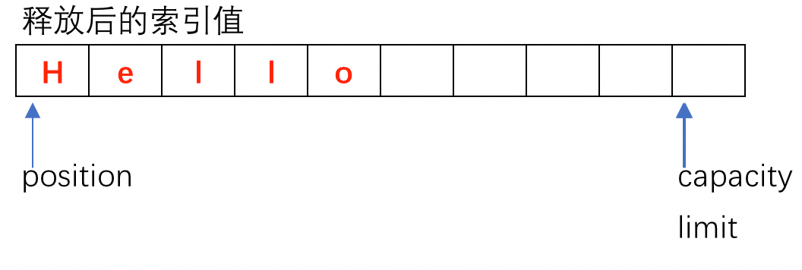

**<br />**ByteBuffer主要用于NIO操作中的数据缓存。**其位于`java.nio` 包下，一个Buffer对象是固定数量的数据的容器。其作用是一个存储器，或者分段运输区，在这里数据可被存储并在之后用于检索。缓存区ByteBuffer 与通道 Channel联系密切，通道Channel是发生IO操作时候的入口，而缓存区则是数据的来源或者目标_。_ByteBuffer 相对于 IO系统中的 InputStream或者OutputStream而言最大的区别是Buffer既可以读也可以写，所以在Buffer读写切换之前需要非常重要翻转操作(文章的后续会着重讲解Buffer的翻转以及其底层实现)。<br />_<br />




## Buffer 基础概念


- 容量(Capacity): 缓**存**区能够容纳的数据元素的最大数量。这一容量在缓**存**区创建时被设定，并且永远不能被改变。
- 上界(Limit): 缓**存**区的第一个不能被读或写的元素。或者说，缓**存**区中现存元素的计数。
- 位置(position): 下一个要被读或写的元素的索引。位置会自动由相应的 get( )和 put( )函数更新。
- 标记(mark): 一个备忘位置。调用 mark( )来设定 mark = postion。调用 reset( )设定 position = mark。标记在设定前是未定义的(undefined)。


<br />这四者的关系是 `0 <= mark <= position <= limit <= capacity` 如下所示<br />


## 缓存区的创建

<br />如同上图中所示 Buffer有不同的实现类，每一种都是对Java原始类型的封装。下面将就ByteBuffer对缓存区的创建进行分析解读。其他Buffer都是类似的实现，读者可以自行阅读相关源码学习了解。<br />
<br />新的缓存区是由系统分配或者包装而来的。比如下面的代码就是分别从直接内存中以及从堆内存中创建的ByteBuffer<br />

```java
// 在堆内存中申请的ByteBuffer,其实际类型为 HeapByteBuffer
// 其底层支持为 byte[] 
ByteBuffer buffer = ByteBuffer.allocate(10);
        
// 在直接内存中申请的ByteBuffer,其实际类型为 DirectByteBuffer
// 其底层是直接使用C++的内存申请函数实现的
buffer = ByteBuffer.allocateDirect(10);


// 通过包装的方式创建ByteBuffer，显然通过这种方式创建的ByteBuffer肯定是HeapByteBuffer
byte[] bytes = "Hello,Java ByteBuffer".getBytes(StandardCharsets.UTF_8);
buffer = ByteBuffer.wrap(bytes);
buffer = ByteBuffer.wrap(bytes, 0, 100);
```

<br />另外也可以通过API进行缓存区的复制 `duplicate()`，这里的复制值得是浅复制，其共享内存数据，其中一个缓存区对于数据的修改都会反映到另外一个缓存区上，但是两者具有不同的索引值。复制完成后两者具有相同的索引值, 源码中也说明了这一点
```java
public ByteBuffer duplicate() {
  return new HeapByteBuffer(hb,
                            this.markValue(),
                            this.position(),
                            this.limit(),
                            this.capacity(),
                            offset);
}
```



<a name="BuSIk"></a>
## 缓**存**区的API

<br />缓**存**区有以下的API，下面将通过源码的方式逐一讲解各个API的作用<br />

- _public final int _capacity() 方法 返回Buffer的容量大小
- _public final int _position() 返回下一个要被读或者写的元素的索引
- _public final _Buffer position(_int _newPosition) 重新设定 position 的索引
- _public final int _limit() 返回读或者写的上限
- _public final _Buffer mark() 记录下position的索引值到mark上，当使用reset的时候将恢复position的值
- _public final _Buffer reset() 恢复 position的索引值
- _public final _Buffer clear() 清除缓**存**区的数据，注意这里并非真的清除，而是通过限制索引的方式使之不可读
- _public final _Buffer flip() 翻转读写，当写完数据后，position指向的是下一个写的索引，要进行的读的话需要将positon 重置，反之亦然
- _public final int _remaining() 返回有效的数据长度，即 limit - position
- _public final boolean _hasRemaining() 返回的布尔值代表是否有有效的数据<br />


> 对于部分的实现缓**存**区其是只允许读操作的，如果执行写操作将会抛出 java.nio.ReadOnlyBufferException#ReadOnlyBufferException 异常


<a name="RSRnP"></a>
## 缓存区的读写操作分析

<br />在缓存区准备好之后，程序代码可以对缓**存**区进行读写操作，ByteBuffer 对于读写操作，内部的细节都是 `position,limit以及 mark` 的变动，下面笔者将从源码的角度对ByteBuffer 的各个操作进行分析。
<a name="InAXg"></a>
### 缓存区的读取

<br />缓存区的读取主要以来的API有 `get() & get(int index)`方法，其源码如下:<br />

```java
// HeapByteBuffer#get()
final byte[] hb;

public byte get() {
    return hb[ix(nextGetIndex())];
}

public byte get(int i) {
  return hb[ix(checkIndex(i))];
}


// DirectByteBuffer#get() 
public byte get() {
    // unsafe.getByte() 方法为native方法
    return ((unsafe.getByte(ix(nextGetIndex()))));
}


// 返回索引然后position值加1
final int nextGetIndex() { // package-private
  if (position >= limit)
     throw new BufferUnderflowException();
     return position++;
 }
```

<br />`java.nio.HeapByteBuffer` 是使用堆内存实现的ByteBuffer，因此在get的时候直接是从内部的char[] 数组中根据position索引获取的，在get()之后position的索引值会加一。同样的ByteBuffer还有一个直接内存的实现类 `java.nio.DirectByteBuffer` , **_这也是 Netty 框架实现零拷贝的一个核心类，在 [netty 源码分析的章节](https://www.zhoutao123.com/page/book/8) 中会详细的阐述零拷贝的概念以及实现_**。

> 另外从源码`nextGetIndex()` 方法中也可以看得非常清楚，在 `get()` 操作完成之后 position 的索引会顺序的+1，而`get(int index)` 则不会跳动索引的值, 实际的编程中要特别的注意这一点。


<a name="46cd09ee"></a>
### 缓存区的填充


上面讲到了ByteBuffer的读取，这一段将阐述ByteBuffer的填充，即对ByteBuffer进行写操作。涉及到ByteBuffer的写操作，主要针对的方法就是`putXXXX()` 系列方法，下面将选取其核心的方法进行分析。 <br />
<br />首先通过一个例子来看在填充之后的各个索引值的情况
```java
ByteBuffer buffer = ByteBuffer.allocate(10);
buffer.put((byte)'H').put((byte)'e').put((byte)'l').put((byte)'l').put((byte)'o');
```



<a name="pfEGE"></a>
### <br />
下面出源码的角度看看，可以看到,put之后，position索引值加1，符合上面的索引示意图
```java
// 堆的HeapByteBuffer的实现
public ByteBuffer put(byte x) {
    hb[ix(nextPutIndex())] = x;
    return this;
}


// 直接内存的DireactByteBuffer的实现
public ByteBuffer put(byte x) {
    unsafe.putByte(ix(nextPutIndex()), ((x)));
    return this;
}
```
<br />
<a name="MVNkn"></a>
### 缓**存**区的翻转


_**缓存区的翻转是一个非常重要的操作，可以简单的理解为从写模式切换到读模式的必须操作。**_我们继续从上面的写入操作接着说，再写入Hello之后，其各个索引的状态为：<br />



那么重点来了，现在是写数据模式，当程序需要读数据的数据的时候 position 应当从当前值开始读吗？ limit的值应该是等于capacity 吗？ 很显然，既然读取数据，肯定是从头开始读取的，所以我们需要**把position的值重置为0**，切换为读模式了之后, limit的值标识的就是读的上限索引了，那么针对这样的情况，它就只能读到原先的写的位置了，所以需要把position的值赋值与limit。这就是flip() 翻转操作的底层实现了，经过翻转操作我们就可以从写模式切换到读模式.<br />
<br />经过写->读的模式切换后，其索引值被更新为<br />
<br />



```java
public final Buffer flip() {
    limit = position;
    position = 0;
    mark = -1;
    return this;
}
```
<br />
<a name="62QRk"></a>
### 缓存区的释放


相对于缓存区的翻转可以理解为写完之后需要读取数据，因此缓存区的释放可以理解为读完之后需要重新写入数据，从场景中也可以得知重新 **写入position的值肯定是等于0，limit的值标识的就是写入的上限，也就是说limit=capacity**，所以在释放之后其索引值更新如下<br />

```java
public final Buffer clear() {
   position = 0;
   limit = capacity;
   mark = -1;
   return this;
}
```

<br />
<br />需要注意的是在释放之后，其实内存中的字节数据并没有真正的释放，其仍然在持有字节数据，在写入的时候则会不断的覆盖，从上图中也可以看出来，在clear() 操作之后，内存中仍然保存着之前的数据, _**在一些场景下可能就会造成内存泄漏**_。下面的程序可以验证:
```java
public static void main(String[] args) {
    ByteBuffer buffer = ByteBuffer.allocate(10);
    buffer.put((byte) 'H')
            .put((byte) 'e')
            .put((byte) 'l')
            .put((byte) 'l')
            .put((byte) 'o');

    // 模拟清除数据
    buffer.clear();

    // 尝试读取前4个字符 并断言
    assert buffer.get() == (byte) 'H';
    assert buffer.get() == (byte) 'e';
    assert buffer.get() == (byte) 'l';
    assert buffer.get() == (byte) 'l';
    assert buffer.get() == (byte) 'o';
}
```


<a name="IS2LL"></a>
### 缓存区的复制

<br />
<br />

<a name="BjHPP"></a>
### 缓存区的其他操作
当然Buffer还提供了其操作API，比如 压缩 以及 重置标记等操作，其本质都是对 各个索引值进行操作，这一点从源码的角度也可以明确的看到，所以这里读者不在赘述，有兴趣的读者可以自行阅读这一部分的源码 `java.nio.HeapByteBuffer`。<br />
<br />

> 本文代码仓库位于 [https://gitee.com/taoes_admin/architect/blob/master/network/src/main/java/com/zhoutao123/architect/buffer/BufferClearDemo.java](https://gitee.com/taoes_admin/architect/blob/master/network/src/main/java/com/zhoutao123/architect/buffer/BufferClearDemo.java)


<br />

