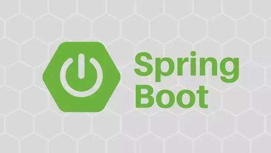

# Spring深入学习笔记概述

本系列将深入SpringBoot 的深层次的知识来学习SpringBoot的相关知识点，这里我们将会不断深入SPringBoot的学习，你会发现SpringBoot不像你想的那么简单。

Spring Boot是由Pivotal团队提供的全新框架，其设计目的是用来简化新Spring应用的初始搭建以及开发过程。该框架使用了特定的方式来进行配置，从而使开发人员不再需要定义样板化的配置。通过这种方式，Spring Boot致力于在蓬勃发展的快速应用开发领域(rapid application development)成为领导者。

SpringBoot所具备的特征有：
（1）可以创建独立的[Spring](https://baike.baidu.com/item/Spring/85061)应用程序，并且基于其Maven或Gradle插件，可以创建可执行的JARs和WARs；
（2）内嵌Tomcat或Jetty等Servlet容器；
（3）提供自动配置的“starter”项目对象模型（POMS）以简化[Maven](https://baike.baidu.com/item/Maven/6094909)配置；
（4）尽可能自动配置Spring容器；
（5）提供准备好的特性，如指标、健康检查和外部化配置；
（6）绝对没有代码生成，不需要XML配置

SpringBoot框架中还有两个非常重要的策略：开箱即用和约定优于配置。开箱即用，Outofbox，是指在开发过程中，通过在MAVEN项目的pom文件中添加相关依赖包，然后使用对应注解来代替繁琐的XML配置文件以管理对象的生命周期。这个特点使得开发人员摆脱了复杂的配置工作以及依赖的管理工作，更加专注于业务逻辑。约定优于配置，Convention over configuration，是一种由SpringBoot本身来配置目标结构，由开发者在结构中添加信息的软件设计范式。这一特点虽降低了部分灵活性，增加了BUG定位的复杂性，但减少了开发人员需要做出决定的数量，同时减少了大量的XML配置，并且可以将代码编译、测试和打包等工作自动化。

SpringBoot应用系统开发模板的基本架构设计从前端到后台进行说明：前端常使用模板引擎，主要有FreeMarker和Thymeleaf，它们都是用Java语言编写的，渲染模板并输出相应文本，使得界面的设计与应用的逻辑分离，同时前端开发还会使用到Bootstrap、AngularJS、JQuery等；在浏览器的数据传输格式上采用Json，非xml，同时提供RESTfulAPI；SpringMVC框架用于数据到达服务器后处理请求；到数据访问层主要有Hibernate、MyBatis、JPA等持久层框架；数据库常用[MySQL](https://baike.baidu.com/item/MySQL/471251)；开发工具推荐IntelliJIDEA。

- 参考链接

[https://baike.baidu.com/item/Spring%20Boot/20249767?fr=aladdin](https://baike.baidu.com/item/Spring%20Boot/20249767?fr=aladdin)
