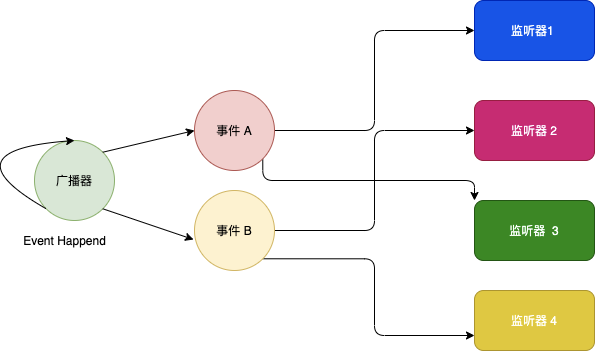
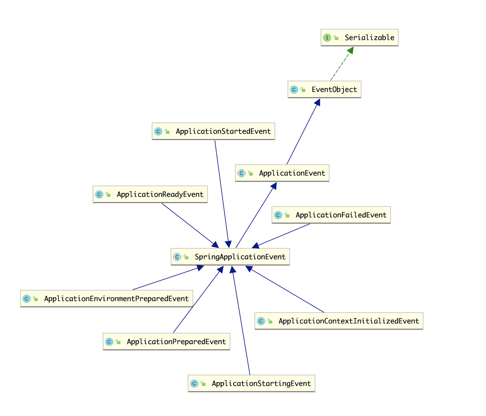
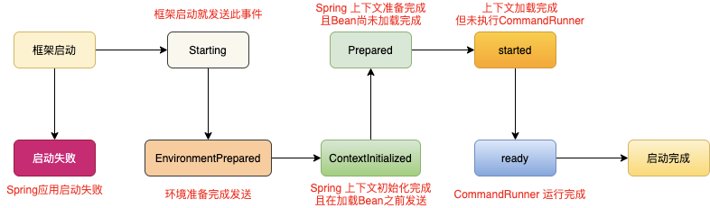

# ApplicationListener


SpringBoot 提供了各种各样的时间监听器( _ApplicationListener 的子类 _)，用来订阅SpringBoot在运行阶段的各种事件，整体的这种方式实现的逻辑图如下图:





## 事件监听器 ApplicationListener


 这个接口是应用的事件的监听器，基于观察者模式实现，从Spring3.0开始，当监听器在Spring上下文注册后， 在Spring的某些阶段出现发出事件的时候，将会执行指定的方法。
```java

@FunctionalInterface
public interface ApplicationListener<E extends ApplicationEvent> extends EventListener {

	/**
	 * 处理一个应用事件
	 * @param event the event to respond to
	 */
	void onApplicationEvent(E event);

}
```


## 多路广播器 ApplicationEventMulticaster


同时，Spring 提供了 _ApplicationEventMulticaster _应用事件广播器，主要用于管理事件监听器和事件的发送。
```java
public interface ApplicationEventMulticaster {
    
    // 新增事件监听器
	void addApplicationListener(ApplicationListener<?> listener);

	// 新增事件监听器
	void addApplicationListenerBean(String listenerBeanName);

	// 移除事件监听器
	void removeApplicationListener(ApplicationListener<?> listener);

	// 移除事件监听器	
	void removeApplicationListenerBean(String listenerBeanName);

	// 移除全部事件监听器
	void removeAllListeners();

	// 发送应用事件
	void multicastEvent(ApplicationEvent event);

	// 发送应用事件
	void multicastEvent(ApplicationEvent event, @Nullable ResolvableType eventType);

}
```


## 事件消息 ApplicationEvent
Spring 提供了Application类，并内置一些Spring的应用事件，如果需要定义领域事件，则需要继承 ApplicationEvent。SpringBoot 内置的SpringApplicationEvent如下图所示。





SpringBoot 的事件发送时还有一定顺序，会按照SpringBoot的启动顺序发送：


)
