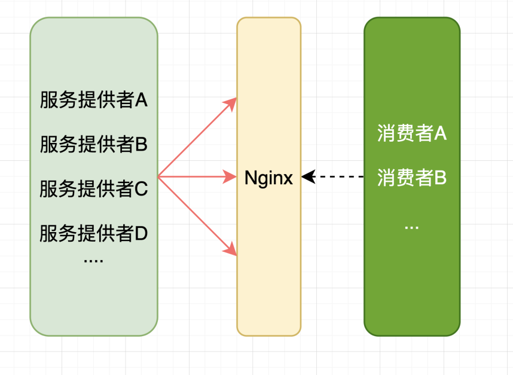
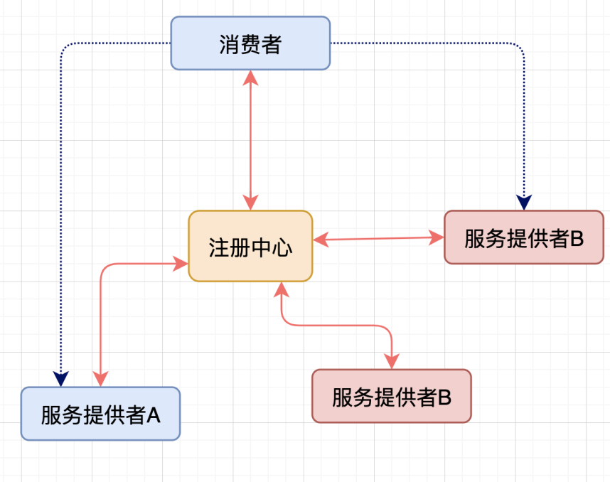

# 服务注册与发现

微服务重要的概念就是将一个单体应用拆分为多个不同的服务，消费者与服务者之间通过轻量级的HTTP请求相互提供服务，那么服务与服务之间如何实现发现的，将是微服务面临的首要问题。


## 实现方案


在以前的项目架构中，服务于服务中间相互发现主要有以下的方式：


- [x]  IP直接的方式： 这种方式将提供某种服务的写死在配置文件中，需要指定服务的时候，通过查询的方式，查到对方服务的IP和端口，这种方式不够灵活，且对于大量的集群服务而言，工作量复杂且容易出错。
- [x] 使用主机名的方式： 将IP映射为主机名，这种方式的本质还是IP的方式，所以不能从根本上解决问题
- [x] 使用DNS作为服务转发
- [x] 使用Nginx代理： Ngixn对外提供统一的网关，消费者通过网关调用，所以此时服务提供者对于消费者而言是透明的。但大量的配置工作转移到了服务提供者这边配置，依然没有解决大量的繁重工作的问题



- [x] 使用注册中心： 目前的主流方式是使用注册中心，注册中心有多种实现方案，比如Zookeeper，Redis等等，其基本的架构图如下所示。




## Netflix Eureka
Eureka 是Netflix公司开发的一款注册中心组件，基于HTTP服务协议与 各个消费者和提供者进行通信，包括注册(Registry)和心跳(HeartBeat)，续约(Renew)等能力。SpringCloud基于Eureka提供了SpringCloud的组件，可以直接在项目中使用。


_**Eureka 在项目的使用中，主要包括两个部分，服务端以及客户端，或者称之为EurekaService & EurekaClient，**__**服务端是提供注册的，是注册中心；**__**客**__**户端是各个提供服务或者消费服务的组件**_。基于CAP理论，Eureka实现了AP两个，并未实现强一致性，所以当服务下线的时候，客户端可能并未及时的接收到服务下线的通知。其基本架构如下:


- [x]  EurekaService 提供了相互注册高可用的能力
- [x]  EurekaClient 分别向多个注册中心注册服务
- [x]  EurekaClient 定时(默认30s)的向注册中心发送心跳包,已证明自己存活
- [x]  EurekaClinet 会从注册中心拉取其他服务的信息，缓存到本地中
- [x] EurekaService 默认开启保护模式，即发现短时间大量服务掉线的时候，会认为出现网络波动，而非服务掉线，所以并不会将服务标记为DOWN


### 实现 EurekaService
Eureka可以单独使用，但是SpringCloud提供了适用于SpringBoot应用的库，所以我们没有必要再次封装，直接依赖SprigCloud提供的依赖即可。
```groovy
buildscript {
    ext {
        springBootVersion = '2.0.5.RELEASE'
        springCloudVersion = 'Finchley.SR1'
    }
}

compile('org.springframework.cloud:spring-cloud-starter-netflix-eureka-server')
compile ('org.springframework.boot:spring-boot-starter-web')
```
和SpringBoot异常，创建一个SpringBoot应用, 在启动的类上添加注解 `@EnableEurekaServer`  该注解会向SpringIOC中注入 `EurekaServerMarkerConfiguration` 
```java
import org.springframework.boot.autoconfigure.SpringBootApplication;
import org.springframework.cloud.netflix.eureka.server.EnableEurekaServer;

@EnableEurekaServer
@SpringBootApplication
public class EurekaServiceApplication {

  public static void main(String[] args) {
    SpringApplication.run(EurekaServiceApplication.class, args);
  }
}
```
修改配置文件 `application.yml` 


```yaml
eureka:
  server:
    enable-self-preservation: false # 关闭保护模式
  client:
    # 定义不需要从注册中心拉取信息，如果是多个注册中心实例，则需要开启从其他注册中心拉取的功能
    fetch-registry: false
    # 定义不需要注册，单注册中心不需要向其他注册中心注册，如果是多个注册中心实例，则需要开启向其他注册中心注册的功能
    register-with-eureka: false
    # 定义注册中心地址
    service-url:
      # 如果有多个注册中心，则需要相互注册，那么这里则需要写上多个地址，中间使用逗号分割
      defaultZone: http://${eureka.instance.hostname}:${server.port}/eureka

# 定义应用名称，这里非常重要，服务名称将是后期SpringCloud各个服务之间通讯的手段
spring:
  application:
    name: eureka-service

# 定义服务的接口
server:
  port: 9900
```
启动程序 `EurekaServiceApplication` 访问 `localhost:9900` 如果可以正常看到SpringCloud的Eureka的界面，就表示注册中心搭建完成.


### 实现 EurekaClient 


创建一个新的SpringBoog项目，添加如下依赖
```groovy
buildscript {
    ext {
        springBootVersion = '2.0.5.RELEASE'
        springCloudVersion = 'Finchley.SR1'
    }
}

compile('org.springframework.cloud:spring-cloud-starter-netflix-eureka-client')
compile ('org.springframework.boot:spring-boot-starter-web')
```


同创建Eureka服务端一样，创建SpringBoot启动类，添加注解 `@EnableEurekaClient` 注意此处和EurekaService 添加的注解并不一样。
```java

@EnableEurekaClient
@SpringBootApplication
public class UserApplication {

  public static void main(String[] args) {
    SpringApplication.run(UserApplication.class, args);
  }
}

```
同样的这里需要修改配置文件 `application.yml` 文件，指定注册中心的URL


```java
eureka:
  instance:
    hostname:  node2
  client:
    # 由于是EurekaClient需要从向注册中心注册以及从注册中心拉取其他客户端的注册数据
    # 所以这里的值均为 true
    fetch-registry: true
    register-with-eureka: true
    # 指定注册中心的URL
    service-url:
	  # 如果有多个注册中心，这里则需要写上多个地址，中间使用逗号分割
      defaultZone: http://localhost:9900/eureka
# 定义应用名称      
spring:
  application:
    name: user
    
# 定义启动端口
server:
  port: 9990
```
启动完成后后，查看注册中心的界面，可以看到USER应用已经正常被注册到EurekaService


### 原理分析
## 
## 
## Alibaba Naocs 
Naocs是阿里巴巴开发的一个更易于构建云原生应用的动态服务发现、配置管理和服务管理平台。可以快速的集成到Dubbo/SpringCloud/K8s等。
Naocs具有以下的特性:

- [x]  动态配置服务
- [x] 服务发现及管理
- [x] 动态DNS服务
> 更多的关于Naocs的使用笔记，等笔者有时间在做这一块~


